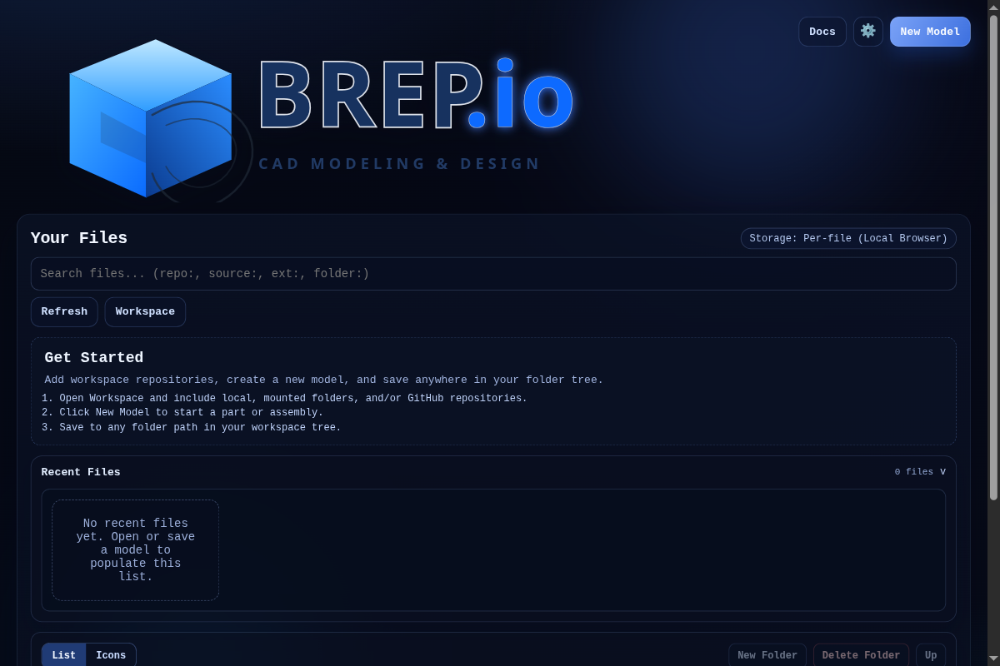
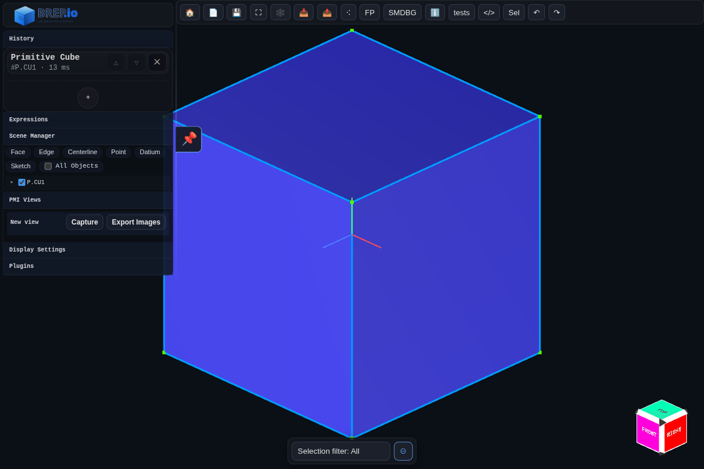
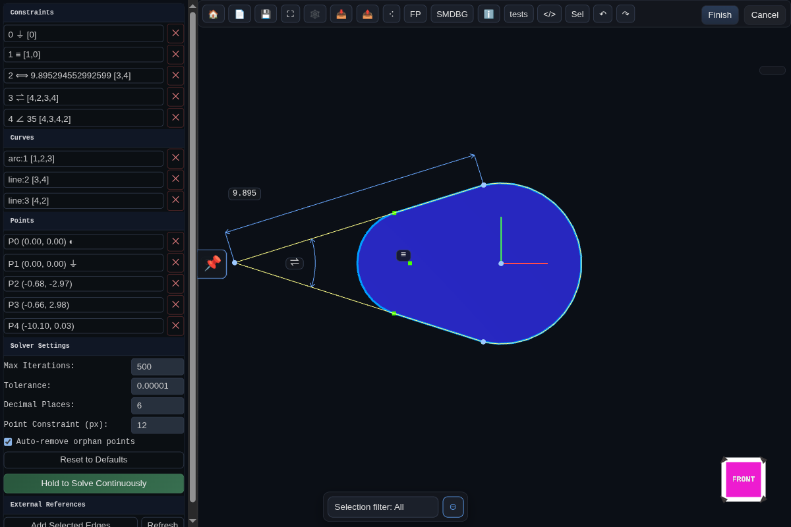
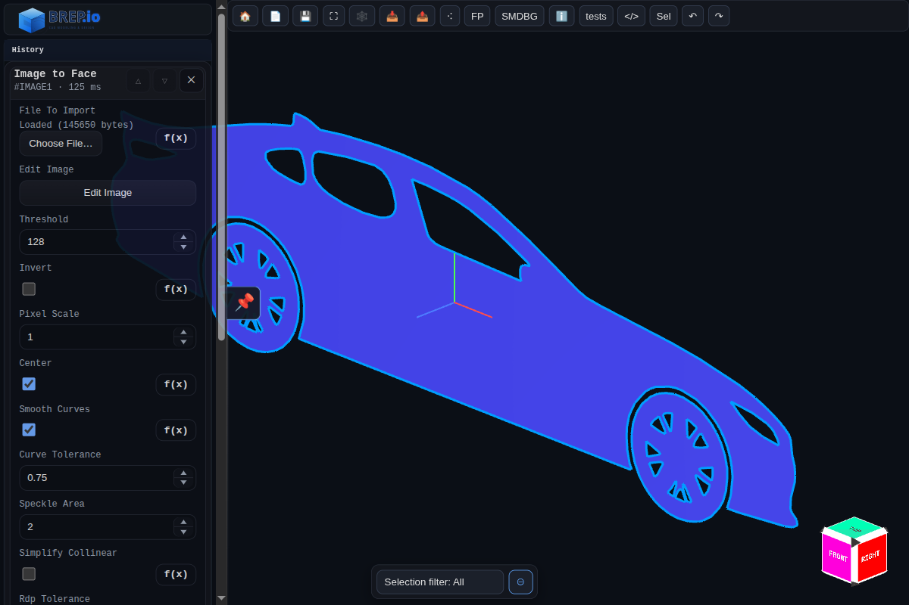

# [BREP](https://github.com/mmiscool/BREP)
## [Source repo https://github.com/mmiscool/BREP](https://github.com/mmiscool/BREP)

A feature-based modeling playground experimenting with BREP-style workflows on top of triangle meshes. It combines robust manifold CSG (via the [Manifold](https://github.com/elalish/manifold/) library) with a simple face and edge representation, a history pipeline, and Three.js visualization. Import meshes (STL), repair and group them into faces, then perform boolean operations, fillets, chamfers, sweeps, lofts, and more.

This project is actively evolving; expect rough edges while APIs settle.

[](docs/modes/modeling.md)
[](docs/modes/sketch.md)
[](docs/modes/pmi.md)
[](docs/features/image-to-face.md)
[](docs/features/image-to-face.md)


## Documentation Map

- [Highlights](docs/highlights.md)
- [What's New](docs/whats-new.md)
- [Getting Started](docs/getting-started.md)
- [Developer Docs Index](docs/developer-index.md)
- [API Examples (Live Demos)](docs/api-examples.md)
- [UI Overview (Browser)](docs/ui-overview.md)
- [How It Works](docs/how-it-works.md)
- [History Systems](docs/history-systems.md)
- [Input Params Schema](docs/input-params-schema.md)
- [BREP Model and Classes](docs/brep-model.md)
- [BREP API (BREP.js exports)](docs/brep-api.md)
- [BREP Kernel (core classes & helpers)](docs/brep-kernel.md)
- [2D Sketch Solver (standalone)](docs/sketch-solver-2d.md)
- [Embeddable CAD App](docs/cad-embed.md)
- [File Formats: Import and Export](docs/file-formats.md)
- [Plugins and Examples](docs/plugins.md)
- [Recent Inspector Improvements](docs/inspector-improvements.md)
- [Inspector](docs/inspector.md)


## Dialog Screenshots

See [Dialog Screenshots](docs/dialog-screenshots.md) for the capture helpers, output locations, and configuration options.


## Run Local Dev Environment
```
# clone repo and cd to the folder
pnpm install
pnpm dev
```

## Produce Static build
```
# clone repo and cd to the folder
pnpm install
pnpm build
```
Generating a static build will create a  ```dist``` folder containing a static build suitable for hosting on a CDN or just being copied to a web server. 


## Application Mode Guides

- [Modeling Mode](docs/modes/modeling.md)
- [Sketch Mode](docs/modes/sketch.md)
- [PMI Mode](docs/modes/pmi.md)
- [Assembly Constraint Solver](docs/assembly-constraints/solver.md)

## Modeling Features

- [Primitive Cube](docs/features/primitive-cube.md) — Implemented
- [Primitive Cylinder](docs/features/primitive-cylinder.md) — Implemented
- [Primitive Cone](docs/features/primitive-cone.md) — Implemented
- [Primitive Sphere](docs/features/primitive-sphere.md) — Implemented
- [Primitive Torus](docs/features/primitive-torus.md) — Implemented
- [Primitive Pyramid](docs/features/primitive-pyramid.md) — Implemented
- [Plane](docs/features/plane.md) — Implemented
- [Datum](docs/features/datum.md) — Implemented
- [Sketch](docs/features/sketch.md) — Implemented
- [Helix](docs/features/helix.md) — Implemented
- [Extrude](docs/features/extrude.md) — Implemented
- [Sweep](docs/features/sweep.md) — Implemented
- [Tube](docs/features/tube.md) — Implemented
- [Loft](docs/features/loft.md) — Implemented
- [Revolve](docs/features/revolve.md) — Implemented
- [Mirror](docs/features/mirror.md) — Implemented
- [Boolean](docs/features/boolean.md) — Implemented
- [Fillet](docs/features/fillet.md) — Implemented
- [Chamfer](docs/features/chamfer.md) — Implemented
- [Hole](docs/features/hole.md) — Implemented
- [Offset Shell](docs/features/offset-shell.md) — Implemented
- [Remesh](docs/features/remesh.md) — Implemented
- [Import 3D Model (STL or 3MF)](docs/features/import-3d-model.md) — Implemented
- [Image Heightmap Solid](docs/features/image-heightmap-solid.md) — Implemented
- [Image to Face (image trace)](docs/features/image-to-face.md) — Implemented
- [Transform (move, rotate, scale)](docs/features/transform.md) — Implemented
- [Pattern Linear](docs/features/pattern-linear.md) — Implemented
- [Pattern Radial](docs/features/pattern-radial.md) — Implemented
- [Pattern (legacy combined)](docs/features/pattern.md) — Implemented
- [Assembly Component](docs/features/assembly-component.md) — Implemented
- [Sheet Metal Tab](docs/features/sheet-metal-tab.md) — Implemented
- [Sheet Metal Contour Flange](docs/features/sheet-metal-contour-flange.md) — Implemented
- [Sheet Metal Flange](docs/features/sheet-metal-flange.md) — Implemented


## Assembly Constraints

Assemblies can be constrained with the iterative solver described in [Assembly Constraint Solver](docs/assembly-constraints/solver.md). Each constraint instance stores clear selections plus persistent solve data so runs resume quickly after edits. The constraint registry currently ships with:

- [Coincident](docs/assembly-constraints/coincident-constraint.md) – mates two datum points or implicit origins.
- [Distance](docs/assembly-constraints/distance-constraint.md) – fixes an offset between reference points along a chosen axis or free space.
- [Angle](docs/assembly-constraints/angle-constraint.md) – enforces a target angle between two axes or faces.
- [Parallel](docs/assembly-constraints/parallel-constraint.md) – locks component axes or normals into parallel alignment.
- [Touch Align](docs/assembly-constraints/touch-align-constraint.md) – slides surfaces until they touch and optionally shares tangency.
- [Fixed](docs/assembly-constraints/fixed-constraint.md) – anchors a component so downstream constraints treat it as immobile.

Adding, removing, or editing any of these entries queues an automatic background solve, and the UI exposes constraint status plus debugging messages pulled from each `persistentData` record.

## PMI annotations

PMI mode focuses on downstream manufacturing communication. Annotating the model augments the saved `.brep` history and the embedded 3MF metadata. The PMI tools mirror the dialog capture pages in `docs/pmi-annotations`:

- [Linear Dimension](docs/pmi-annotations/linear-dimension.md) – measures distances between vertices with alignment, offsets, and extension controls.
- [Radial Dimension](docs/pmi-annotations/radial-dimension.md) – reports diameter/radius for arcs, circles, and cylinders.
- [Angle Dimension](docs/pmi-annotations/angle-dimension.md) – dimension angular relationships across edges or faces.
- [Leader](docs/pmi-annotations/leader.md) – callouts with free-form text, arrowhead placement, and captured drag offsets.
- [Note](docs/pmi-annotations/note.md) – rich-text style annotations tied to PMI views without leader geometry.
- [Explode Body](docs/pmi-annotations/explode-body.md) – stores exploded-view offsets per component for presentation layouts.
- [Hole Callout](docs/pmi-annotations/hole-callout.md) – leader-style callout that reports hole feature parameters (diameters, depths, countersink/counterbore).

Each annotation stores associative references and view metadata so reloading a part restores the PMI viewport, label placement, and formatting settings.

## Using as an npm package

The published package is `brep-io-kernel`. It ships as a single ESM bundle that
inlines the WASM, so consumers do not need any extra asset copying or loader
configuration.
[https://www.npmjs.com/package/brep-io-kernel](https://www.npmjs.com/package/brep-io-kernel)

- Examples (Node.js):
  - [`brep-io-kernel-examples/README.md`](brep-io-kernel-examples/README.md)

- Install:
  - `pnpm add brep-io-kernel`
- Import (ESM):
  - `import { BREP, PartHistory } from 'brep-io-kernel';`
  - `import { AssemblyConstraintHistory, AssemblyConstraintRegistry } from 'brep-io-kernel';`
  - `import { CadEmbed, Sketcher2DEmbed } from 'brep-io-kernel';`
- Subpath imports (BREP kernel bundle):
  - `import { BREP } from 'brep-io-kernel/BREP';`
  - `import { PartHistory } from 'brep-io-kernel/PartHistory';`
  - `import { CadEmbed } from 'brep-io-kernel/CAD';`
- Standalone 2D sketch solver:
  - `import { ConstraintSolver, ConstraintEngine, constraints } from 'brep-io-kernel/SketchSolver2D';`

Notes:
- This package is ESM-only. If you are in CommonJS, use dynamic import:
  - `const { BREP } = await import('brep-io-kernel');`
- Top-level await is used internally; target modern runtimes (Node 18+ or modern bundlers).

License helpers (package-only vs full dependency summary):
```js
import { getPackageLicenseInfoString, getAllLicensesInfoString } from 'brep-io-kernel';

console.log(getPackageLicenseInfoString()); // this package only
console.log(getAllLicensesInfoString()); // includes prod dependency summary
```


## License

See [LICENSE.md](LICENSE.md). This project uses a dual-licensing strategy managed by Autodrop3d LLC.

## Contributing

See [CONTRIBUTING.md](CONTRIBUTING.md) for guidelines on submitting pull requests, reporting issues, and participating in discussions.

Test write using github user key 
