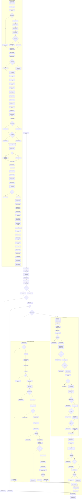

# Fillet Process

```mermaid
flowchart TB
    A[User creates or runs FilletFeature] --> B[Read debug mode and derive debug config]
    B --> C[Read inputParams.edges and preview snapshots]
    C --> D[Expand reference selections into scene objects]
    D --> E[Collect edge objects from resolved selections]
    E --> F[Try to resolve sheet-metal carrier from raw selections]
    F --> G[Resolve single target solid from edge objects]
    G --> H{Sheet-metal carrier found?}
    H -- Yes --> I[Force target solid to sheet-metal carrier]
    H -- No --> J[Use solid resolved from selected edges]
    I --> K{Target solid resolved?}
    J --> K
    K -- No --> K1[Abort fillet and return no added/removed objects]
    K -- Yes --> L[Validate radius and normalize direction]
    L --> M{Radius > 0?}
    M -- No --> M1[Abort fillet and return no added/removed objects]
    M -- Yes --> N{Target is sheet-metal carrier?}

    N -- Yes --> SM0
    N -- No --> S0

    subgraph SheetMetalPath [Sheet-Metal Corner Fillet Replacement Path]
        direction TB
        SM0[Build sheet source from carrier]
        SM0 --> SM1{Sheet source found?}
        SM1 -- No --> SM1A[Return handled false summary with no_sheet_source]
        SM1 -- Yes --> SM2[Clone sheet tree]
        SM2 --> SM3[Resolve sheet-metal fillet targets from selections and edge selections]
        SM3 --> SM4[Apply corner fillets to tree]
        SM4 --> SM5[Validate radius]
        SM5 --> SM6{Radius valid?}
        SM6 -- No --> SM6A[Mark all requested targets skipped]
        SM6 -- Yes --> SM7[Group targets by flat and outline corner anchors]
        SM7 --> SM8[For each target resolve flat/edge or corner-pair match]
        SM8 --> SM9{Target edge/corner valid on outer outline?}
        SM9 -- No --> SM9A[Mark target skipped with reason]
        SM9 -- Yes --> SM10[Create per-flat fillet plan]
        SM10 --> SM11[For each flat plan locate eligible convex corner anchors]
        SM11 --> SM12{Eligible corners found?}
        SM12 -- No --> SM12A[Mark plan sources skipped]
        SM12 -- Yes --> SM13[Round each eligible outline corner into an arc polyline]
        SM13 --> SM14[Replace flat outline with rounded loop]
        SM14 --> SM15[Rebuild flat outer edges from rounded outline]
        SM15 --> SM16{Rebuild succeeded?}
        SM16 -- No --> SM16A[Restore old outline/edges and mark skipped]
        SM16 -- Yes --> SM17[Record applied targets and applied corner count]
        SM17 --> SM18[Restore flat boundary vertices and synchronize bend/attach subdivision]
        SM18 --> SM19{Any corners actually applied?}
        SM19 -- No --> SM19A[Return handled true with null root and no_corners_modified or no_sheet_metal_edge_targets]
        SM19 -- Yes --> SM20[Update sheet metadata and last feature id]
        SM20 --> SM21[Build renderable sheet model from updated tree]
        SM21 --> SM22[Preserve sheet-metal face names and carrier name]
        SM22 --> SM23[Set persistentData.usedSheetMetalPath to true and store summary]
        SM23 --> SM24{Renderable root built?}
        SM24 -- No --> SM24A[Return no replacement]
        SM24 -- Yes --> SM25[Return added:new sheet root and removed:old carrier]
    end

    subgraph SolidPath [Standard Solid Fillet Path]
        direction TB
        S0[Read standard fillet toggles: simplify, native tiny-face cleanup, reverse nudge, merge end caps, sliver reassign, collapse tiny triangles, post-collapse cleanup]
        S0 --> S1[Call targetSolid.fillet]
        S1 --> S2[Require native combined/batch/corner-bridge/classifier support]
        S2 --> S3[Validate radius again]
        S3 --> S4[Resolve and dedupe selected edges on this solid]
        S4 --> S5{Any edges resolved?}
        S5 -- No --> S5A[Return unchanged clone of solid]
        S5 -- Yes --> S6[Build authoring-state snapshot of target solid]
        S6 --> S7[Build per-edge payloads: names, face names, local polylines, closedLoop flags, optional segment-face pairs]
        S7 --> S8{Any valid edge payloads built?}
        S8 -- No --> S8A[Return unchanged clone of solid]
        S8 --> S9[Call native buildFilletAuthoringState]
        S9 --> S10{Native fillet build succeeded?}
        S10 -- No --> S10A[Log native failure and return unchanged clone]
        S10 -- Yes --> S11[Optional: log AUTO direction classification summary]
        S11 --> S12[Rehydrate final snapshot into a new Solid]
        S12 --> S13{Final snapshot present?}
        S13 -- No --> S13A[Return unchanged clone]
        S13 -- Yes --> S14[Optional: rehydrate native debug snapshots into debug solids]
        S14 --> S15[Attach direction decision, corner bridge count, and end-cap toggle metadata to result]
        S15 --> S16{Reverse end-cap nudge enabled?}
        S16 -- No --> S16A[Set reverse-nudge count to 0]
        S16 -- Yes --> S17[Reverse post-boolean fillet end-cap nudge on eligible end-cap faces]
        S17 --> S18{Merge coplanar end caps enabled?}
        S16A --> S18
        S18 -- No --> S18A[Set end-cap merge count to 0]
        S18 -- Yes --> S19[Find coplanar adjacent face for each fillet end cap and rename face ids to merge labels]
        S19 --> S20{Sliver triangle reassignment enabled?}
        S18A --> S20
        S20 -- No --> S20A[Set sliver reassign count to 0]
        S20 -- Yes --> S21[Reassign tiny fillet sidewall sliver triangles into planar neighbor faces]
        S21 --> S22[Return solid result to FilletFeature.run]
        S20A --> S22
    end

    subgraph NativeAuthoring [Native buildFilletAuthoringState Pipeline]
        direction TB
        N0[Receive target snapshot, edge payloads, radius, direction mode, inflate, nudge, resolution, cleanup area, debug flags]
        N0 --> N1[Run buildFilletBatchAuthoringState]
        N1 --> N2[For each edge decide direction]
        N2 --> N3{Direction mode AUTO?}
        N3 -- No --> N3A[Use explicit INSET/OUTSET]
        N3 -- Yes --> N4[Run classifyFilletEdgeDirection]
        N4 --> N5[Resolve shared boundary chain between faceA and faceB]
        N5 --> N6[Resolve oriented edge tangent and local normals at boundary midpoint]
        N6 --> N7[Vote for inset/outset using signed dihedral / sample classification]
        N7 --> N8{Classifier produced confident result?}
        N8 -- No --> N8A[Use fallback direction and mark fallback/ambiguous counts]
        N8 -- Yes --> N8B[Use classified direction]
        N3A --> N9
        N8A --> N9
        N8B --> N9
        N9[Build one native edge fillet entry with buildFilletEdgeAuthoringState]
        N9 --> N10[Compute fillet centerline for the edge]
        N10 --> N11[Sanitize input polyline and build centerline samples]
        N11 --> N12{Segment-face pairs supplied?}
        N12 -- No --> N12A[Use fixed faceA/faceB meshes along the edge]
        N12 -- Yes --> N12B[Resolve per-segment/blended face context]
        N12A --> N13
        N12B --> N13
        N13[For each sample project onto host faces and compute local normals]
        N13 --> N14[Build tangent frame and bisector]
        N14 --> N15[Estimate max allowed radius from face projection ranges]
        N15 --> N16[Solve inset and outset center candidates from offset planes]
        N16 --> N17[Score candidates against projected tangency and requested side]
        N17 --> N18[Choose center candidate or fallback bisector/average-normal center]
        N18 --> N19[Refine center against reprojected tangency points when needed]
        N19 --> N20[Clamp pathological center distances]
        N20 --> N21[Collect centerline point, tangentA, tangentB, and edge sample]
        N21 --> N22[Stabilize open endpoints or close the loop]
        N22 --> N23[Fix winding and align rails to centerline ends]
        N23 --> N24[Return centerline/tangent/edge rails and optional radius-clamp info]
        N24 --> N25[Sanitize tangent rails]
        N25 --> N26{Inflate offset requested?}
        N26 -- Yes --> N26A[Apply tangent offset to tangent rails]
        N26 -- No --> N26B[Keep tangent rails unchanged]
        N26A --> N27
        N26B --> N27
        N27{Need wedge inset adjustment?}
        N27 -- Yes --> N27A[Inset edge rail for wedge construction]
        N27 -- No --> N27B[Keep edge rail for wedge construction]
        N27A --> N28
        N27B --> N28
        N28[Build fillet segment geometry with buildFilletSegmentAuthoringState]
        N28 --> N29[Create wedge triangles from centerline, tangency rails, and edge rail]
        N29 --> N30{Open edge?}
        N30 -- Yes --> N30A[Add end-cap faces and push them outward by nudge distance]
        N30 -- No --> N30B[Build closed-loop wedge faces only]
        N30A --> N31
        N30B --> N31
        N31[Apply wedge metadata]
        N31 --> N32[Build tube along centerline path]
        N32 --> N33[Apply tube metadata]
        N33 --> N34[Boolean wedge minus tube to create one edge fillet solid]
        N34 --> N35[Collect tube cap points for open edges]
        N35 --> N36[Store edge entry: wedge snapshot, tube snapshot, final snapshot, centerline data, direction]
        N36 --> N37[Repeat for all selected edges]
        N37 --> N38[Detect shared non-tangent endpoints between compatible entries]
        N38 --> N39{Corner bridge needed?}
        N39 -- No --> N39A[Skip bridge for that pair]
        N39 -- Yes --> N40[Build corner bridge]
        N40 --> N41[Resolve wedge/tube cap point sets near shared corner]
        N41 --> N42[Reject if centerlines cross or tube gap is too small]
        N42 --> N43[Build wedge bridge hull, subtract adjacent edge tubes, build bridge tube]
        N43 --> N44[Boolean corner bridge wedge minus bridge tube]
        N44 --> N45[Append corner bridge as another fillet entry]
        N45 --> N46[For each non-corner entry decide whether start/end caps should be merged into sidewall label]
        N46 --> N47[Build combine entry list with direction and optional face-rename merge metadata]
        N47 --> N48[Call buildFilletCombinedAuthoringState]
        N48 --> N49[Normalize target snapshot for booleans]
        N49 --> N50[Normalize each fillet entry snapshot for booleans]
        N50 --> N51[Optional: rename entry faces into one merged sidewall face before combine]
        N51 --> N52[Union all INSET tools together and all OUTSET tools together]
        N52 --> N53[Subtract inset group from target]
        N53 --> N54[Union outset group into target]
        N54 --> N55[Combine id maps, metadata, and aux edges]
        N55 --> N56[Relabel fallback face names by adjacency]
        N56 --> N57[Clean up tiny face islands in the combined native result]
        N57 --> N58[Build final combined snapshot and attach debug snapshots]
    end

    S22 --> F0
    SM25 --> F9
    SM24A --> F8
    SM19A --> F8

    subgraph FeatureFinalize [Back In FilletFeature.run]
        direction TB
        F0[Attach simplify/native-cleanup/post-cleanup flags onto returned solid]
        F0 --> F1[Collect debug solids from native result]
        F1 --> F2[Store persistentData.edgeDirectionDecision cornerBridgeCount and usedSheetMetalPath false]
        F2 --> F3{Result object exists?}
        F3 -- No --> F3A[Throw fillet returned no result]
        F3 -- Yes --> F4{Final simplify enabled?}
        F4 -- Yes --> F4A[Run result.simplify with tolerance 0.0004]
        F4 -- No --> F5
        F4A --> F5[Measure triangle and vertex counts]
        F5 --> F6{Geometry empty?}
        F6 -- Yes --> F6A[Throw fillet produced empty geometry]
        F6 -- No --> F7[Queue result solid and debug solids in added and queue original target solid in removed]
        F7 --> F8[For each added solid optionally collapse tiny triangles]
        F8 --> F9[For each added solid optionally run post-collapse tiny-face island cleanup]
        F9 --> F10[Visualize each added solid]
        F10 --> F11[Return added and removed object lists]
    end

    SM1A --> F11
    K1 --> F11
    M1 --> F11
    F11 --> Z[Scene replacement uses returned added/removed objects]
```
