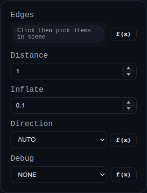

# Chamfer

Status: Implemented

Chamfer builds a bevel on the selected edges of a single solid using the BREP kernel.

## Inputs
- `edges` – select edges directly or pick faces to gather all of their boundary edges.
- `distance` – the single offset distance used for both faces meeting at each edge.

## Behaviour
- All selected edges must belong to the same solid. When multiple faces are selected the feature expands them into unique edges.
- The target solid is replaced by the chamfered result when the operation succeeds.
