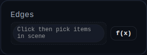

# Collapse Edge

Status: Implemented

Collapse Edge collapses selected edges to points on cloned solids, then replaces the original solids.

## Inputs
- `edges` – one or more `EDGE` selections to collapse.

## Behaviour
- Groups selected edges by owning solid, clones each solid, and resolves matching edges on the clone by name/metadata/polyline similarity.
- Calls `collapseToPoint()` on each resolved edge.
- Replaces source solids only when at least one collapse succeeded and the resulting geometry is still valid.
- Stores summary counts in `persistentData` (for example `totalCollapsedEdges`, `targetSolidCount`).
