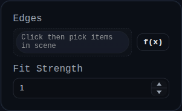

# Edge Smooth

Status: Implemented

Edge Smooth curve-fits open edge polylines and relaxes nearby vertices to smooth faceted boundaries.

## Inputs
- `edges` – selections of `EDGE`, `FACE`, or `SOLID` entities. Face/solid picks expand to their edges.
- `fitStrength` – blend factor from `0` to `1` toward the fitted curve.

## Behaviour
- Expands the selection set into concrete edges, then groups them by owning solid.
- Works on cloned solids, preserving originals until a valid smoothed result is produced.
- Fits open-edge polylines and closed edge loops, computes constrained vertex targets, and moves vertices while locking open-edge endpoints where required.
- Replaces the original solids on success and records detailed stats in `persistentData` (moved vertices, matched edges, skipped loops, and fit strength).
