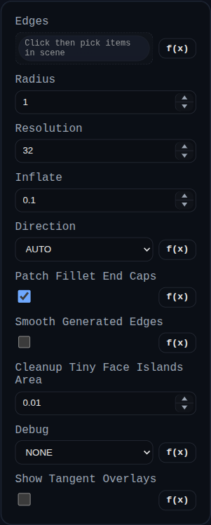

# Fillet

Status: Implemented

Fillet replaces selected edges on a single solid with a constant-radius blend generated by `BREP.filletSolid`.

## Inputs
- `edges` – pick edges directly or select faces to expand into their boundary edges.
- `radius` – constant radius applied to every edge.
- `resolution` – number of segments around the fillet tube; increase for smoother large radii.
- `inflate` – offsets tangency curves and end caps to avoid coplanar leftovers; closed loops skip the wedge inset to avoid self‑intersection.
- `direction` – `AUTO` (default) classifies each selected edge as inside/outside and applies the corresponding boolean (`INSET` => subtract, `OUTSET` => union). You can still force `INSET` or `OUTSET`.
- `patchFilletEndCaps` – enabled by default; moves eligible three-face tip points and patches selected end-cap triangles.
- `smoothGeneratedEdges` – optional endpoint-constrained curve fitting on newly generated fillet boundary edges.
- `cleanupTinyFaceIslandsArea` – area threshold for relabeling tiny disconnected face islands (`<= 0` disables).
- `debug` – keeps helper bodies visible and logs extra diagnostics.
- `showTangentOverlays` – adds pre-inflate tangency polylines to the helper tube for debugging.

## Behaviour
- All selected edges must belong to the same solid; face picks expand to boundary edges before the builder runs.
- Helper tube/wedge bodies are generated per edge, grouped by resolved side, then applied in one unified pass: subtract all `INSET` tools and union all `OUTSET` tools.
- In `AUTO`, edge side is decided per edge (signed-dihedral first, inside/outside probing as fallback) so mixed inside/outside selections can run in one feature.
- Closed-loop paths suppress the wedge inset used for INSET cuts so the cutter does not self-intersect; tangency offsets still keep the fillet slightly inflated to avoid coplanar seams.
- On success the original solid is replaced by the blended result. Enabling `debug` leaves helper solids (and optional tangent overlays) in the scene for inspection.
