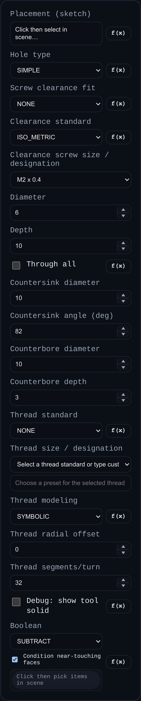

# Hole

Status: Implemented

Adds drilled-style holes from sketch points, with support for countersink, counterbore, and threaded hole generation.

## Inputs
- `face` – placement sketch reference. The feature reads sketch points (excluding the sketch origin point) and creates one hole per unique point.
- `holeType` – `SIMPLE`, `COUNTERSINK`, `COUNTERBORE`, or `THREADED`.
- `clearanceFit` / `clearanceStandard` / `clearanceDesignation` – optional clearance-hole lookup controls for non-threaded holes (`NONE` keeps manual diameter).
- `diameter` – base straight-hole diameter (or fallback when clearance lookup is disabled).
- `depth` – straight depth for non-through holes.
- `throughAll` – extends the cut through the target body thickness.
- `countersinkDiameter` / `countersinkAngle` – countersink controls.
- `counterboreDiameter` / `counterboreDepth` – counterbore controls.
- `threadStandard` / `threadDesignation` – thread definition for `THREADED` holes.
- `threadMode` – `SYMBOLIC` or `MODELED`.
- `threadRadialOffset` – radial clearance/interference offset for thread geometry.
- `threadSegmentsPerTurn` – tessellation for modeled threads.
- `debugShowSolid` – keeps/visualizes tool solids for debugging.
- `boolean` – optional target/operation configuration (defaults to subtract behavior).

## Behaviour
- Requires a sketch selection for placement. Hole centers are taken from sketch vertices and de-duplicated by position.
- Chooses or infers a boolean target solid from explicit targets, sketch parent, or nearest solid in scene.
- Builds per-point tool solids (cylinder/countersink/counterbore/thread), transforms them along the sketch normal, then applies boolean subtraction (or requested operation).
- For threaded holes, symbolic mode prioritizes speed while modeled mode generates helical geometry and stores thread metadata.
- Stores hole descriptors in `persistentData.holes` for downstream PMI Hole Callout annotations.
