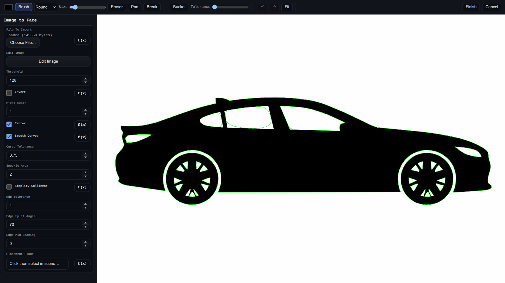

# Image Editor (Shared)

Status: Implemented

The in-app Image Editor is shared by `Image to Face` and `Image Heightmap Solid`. It is a full-screen raster editor with live preview updates and save/cancel handoff back to the feature dialog.

## Where It Is Used
- [Image to Face](./image-to-face.md) via `editImage`
- [Image Heightmap Solid](./image-heightmap-solid.md) via `editImage`

## Open / Save Flow
1. Open a feature dialog (`Image to Face` or `Image Heightmap Solid`).
2. Click `Edit Image`.
3. Edit the bitmap in the full-screen editor.
4. Click `Finish` to write a PNG data URL back into `fileToImport`, or `Cancel` to discard edits.

## Tools
Toolbar buttons use icon glyphs; hover a button for its tooltip/label.
- Brush 🖌 (`B`) – paint with color + brush size.
- Eraser ⌫ (`E`) – erase to transparency.
- Bucket 🪣 (`G`) – flood fill with adjustable tolerance (`0-255`).
- Pan ✋ (button or hold `Space`) – drag the view.
- Break ✂ – add/remove manual edge-break points on traced loops (mainly relevant for `Image to Face` edge segmentation).

Other toolbar buttons: Undo ↶, Redo ↷, Fit ⤢, and text-labeled `Finish` / `Cancel`. The parameter panel is opened/closed by its drawer tab (see [Layout / Drawers](#layout--drawers)), not a toolbar button.

Brush shapes:
- `Round`
- `Square`
- `Diamond`

The brush **Size** and bucket **Tolerance** fields display as compact number inputs; clicking (focusing) a field turns it into a range slider for dragging, and it reverts to a number input when you click away.

## View Controls
- Mouse wheel zooms at cursor.
- Two-finger pinch zooms and pans on touch devices.
- `Fit` button (or `F`) resets view to fit the working canvas.
- Default open view is 1:1 image pixel display.
- Bottom-right resize handle changes working canvas size (supports expanding/cropping while preserving existing edits). The handle uses a larger hit area on touch/pen devices.

## Layout / Drawers
- The canvas fills the whole editor; the toolbar and the parameter panel float over it as drawers.
- Each drawer has a pull-tab (styled like the main application's sidebar pin tab); click it to open or close the drawer.
  - Toolbar drawer: slides down from the top; its tab (toolbox icon 🧰) sits on the toolbar's bottom edge.
  - Params drawer: its tab uses a gear icon ⚙. On wide screens it slides in from the right (offset below the toolbar so it never covers the `Finish`/`Cancel` buttons); on narrow (mobile) screens it becomes a bottom sheet with its tab on the top edge, so the image stays visible while it is collapsed.
- Defaults: the toolbar is open; the params drawer is open on wide screens and collapsed on mobile.

## Touch / Mobile Support
- Input is handled through Pointer Events, so mouse, touch, and pen all work.
- One finger draws (or pans/inserts breaks, depending on the active tool); two fingers pinch to zoom and pan. Bringing a second finger down cancels any in-progress single-finger stroke.
- The toolbar wraps onto multiple rows on narrow screens, and buttons/controls (including the drawer tabs) get larger touch targets.

## Undo / Redo And Hotkeys
- `Undo`: `Ctrl/Cmd+Z`
- `Redo`: `Ctrl/Cmd+Y` or `Ctrl/Cmd+Shift+Z`
- `Finish`: `Enter`
- `Cancel`: `Esc`

## Feature-Specific Notes
- `Image to Face`: editor can include the parameter form in the sidebar and uses live traced-vector overlays + edge-break management (`edgeBreakPoints`, `edgeSuppressedBreaks`).
- `Image Heightmap Solid`: uses the same raster editing workflow to prepare heightmap imagery before height sampling.
