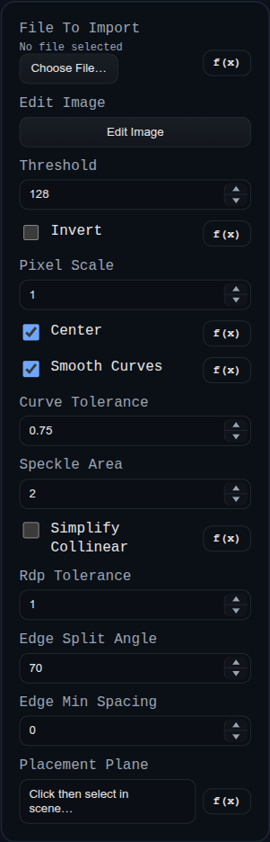
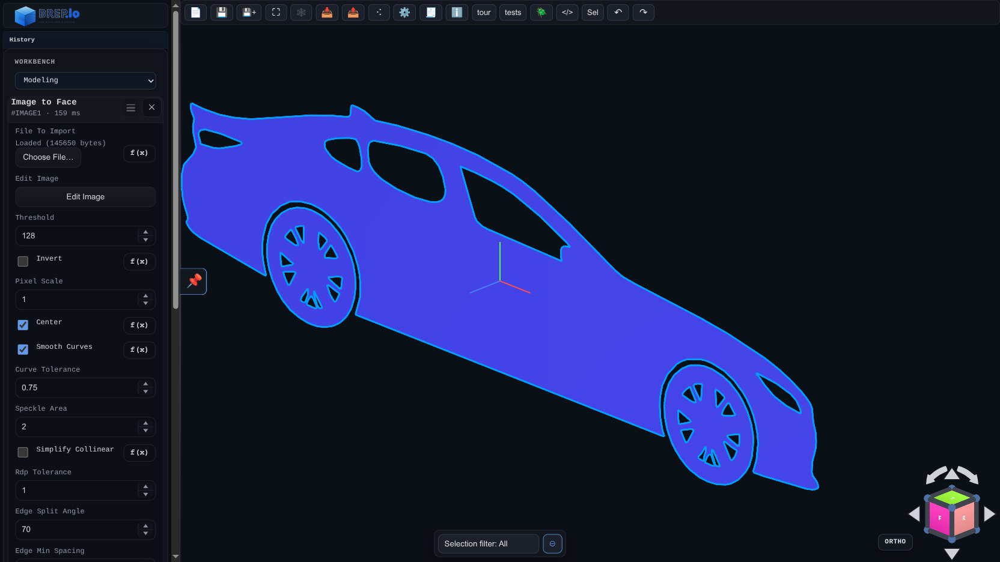

# Image to Face

Status: Implemented

Image to Face traces a PNG into sketch geometry that can be consumed by downstream modeling features.

## Inputs
- `fileToImport` – source PNG payload.
- `editImage` – opens the integrated paint-style editor and writes the edited image back into the feature.
- `threshold` / `invert` – foreground classification controls.
- `pixelScale` – world units per image pixel. Scales the finished polylines only; it does not affect tracing, smoothing, or simplification (see Behaviour).
- `center` – centers the traced result around the origin.
- `smoothCurves` / `curveTolerance` – optional curve fitting controls.
- `speckleArea` – drops tiny loops below the configured pixel area.
- `simplifyCollinear` / `rdpTolerance` – polyline simplification controls (only apply when `smoothCurves` is off).
- `placementPlane` – optional target plane/face for placement.

### Conditional visibility
The dialog shows only the fields relevant to the current selections (same mechanism as the Hole feature):
- Before an image is present, only `fileToImport`, `editImage`, and `placementPlane` are shown.
- When `smoothCurves` is on, `curveTolerance` is shown and `simplifyCollinear` / `rdpTolerance` are hidden (curve fitting consumes the raw trace, so those simplification knobs do not apply).
- When `smoothCurves` is off, `simplifyCollinear` / `rdpTolerance` are shown and `curveTolerance` is hidden.

Tolerances (`curveTolerance`, `rdpTolerance`) are expressed in **image pixels**.

## Shared Image Editor
This feature uses the shared editor documented at [Image Editor (Shared)](./image-editor.md).

Relevant editor functions for Image to Face:
- Raster editing: brush, eraser, bucket fill, pan/zoom, canvas resize, undo/redo.
- Trace-assist controls: live vector overlay, manual break placement/removal (`Break` tool), and persisted break metadata.
- Sidebar parameter editing (when opened from this feature) so trace parameters can be adjusted while editing.

How to use:
1. Click `Edit Image`.
2. Draw/clean the bitmap and optionally tune trace behavior.
3. Click `Finish` to push the edited PNG back into `fileToImport`, then rebuild the feature.

## Behaviour
- Decodes image data, traces contour loops, applies optional smoothing/simplification, and discards invalid/intersecting loops.
- The full trace → curve-fit → simplify pipeline runs entirely in image pixel space with pixel-unit tolerances. `pixelScale` is applied to the finished polylines afterward, so it purely sizes the result — changing it does not alter the traced shape, vertex count, or corner placement.
- Corner detection is chord-based over arc-length windows, so corners between diagonal (staircased) edges are found as reliably as axis-aligned ones. Arcs between detected corners are smoothed and simplified independently so corner vertices survive exactly.
- Emits a `SKETCH` group with a triangulated face plus edge polylines, including boundary-loop metadata for downstream features.
- If `placementPlane` is provided, maps traced geometry into the selected plane/face basis; otherwise uses world default placement.
- Stores editor/breakpoint state in feature data so manual image edits and split decisions survive rebuilds.
