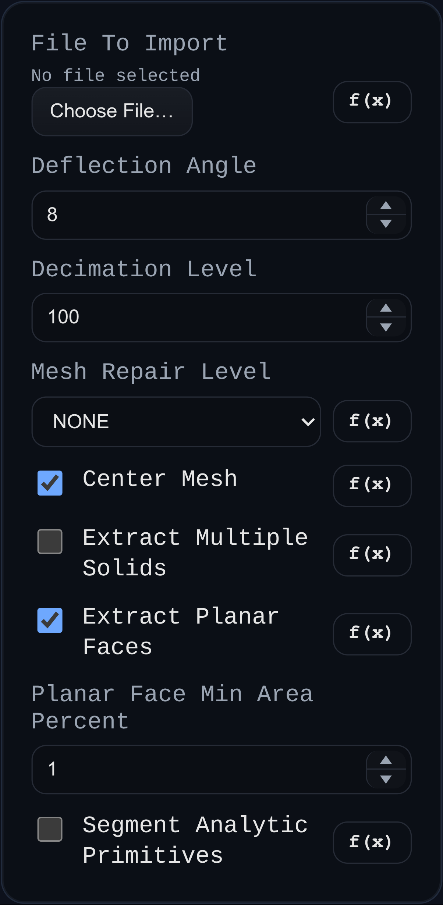

# Import 3D Model

Status: Implemented

Import 3D Model loads STL or 3MF data, optionally runs a mesh repair pass, and converts the triangles into one or more `BREP.MeshToBrep` solids.

## Inputs
- `fileToImport` – STL (ASCII or binary) or 3MF data supplied as a string, data URL, or ArrayBuffer.
- `deflectionAngle` – face split angle in degrees used when converting the triangle mesh into analytic faces.
- `decimationLevel` – percent of original mesh detail to keep before repair and face grouping (`100` keeps original mesh).
- `meshRepairLevel` – `NONE`, `BASIC`, or `AGGRESSIVE` passes through `BREP.MeshRepairer`.
- `centerMesh` – translate the imported geometry so its bounding box center is at the origin before conversion.
- `extractMultipleSolids` – when enabled, splits disconnected triangle islands into separate solids.
- `extractPlanarFaces` – enables planar-region extraction before angle-based grouping.
- `planarFaceMinAreaPercent` – minimum planar region size (percent of total mesh area) used when `extractPlanarFaces` is enabled.
- `segmentAnalyticPrimitives` – when enabled, preserves existing face boundaries and refines each non-planar face independently using primitive segmentation (`PLANE`, `CYLINDER`, `CONE`, `OTHER`).

## Behaviour
- Strings are treated as ASCII STL unless the data begins with a base64 data URL; ArrayBuffers are inspected for ZIP headers (`PK`) to decide between 3MF and binary STL.
- When a 3MF file is provided, all meshes in the archive are transformed into world space and merged into a single BufferGeometry before conversion.
- The feature caches a solid snapshot in `persistentData.importCache` keyed by both source payload and import parameters so timeline rebuilds can skip reparsing.
- The importer also caches the original parsed mesh payload and always reapplies decimation from that source mesh, so changing `decimationLevel` does not compound reductions across edits.
- Setting `decimationLevel` back to `100` restores the same imported source geometry used before decimation.
- `extractMultipleSolids` is optional; when disabled (default), the importer keeps the previous behavior and produces one solid. When enabled, disconnected triangle islands are emitted as separate solids.
- Primitive segmentation is optional and controlled by a dialog checkbox; when enabled, the importer does not merge existing faces. Instead, it keeps current splits and only subdivides non-planar faces into smaller primitive regions.
- No timeline or feature history is recovered from the source file.
