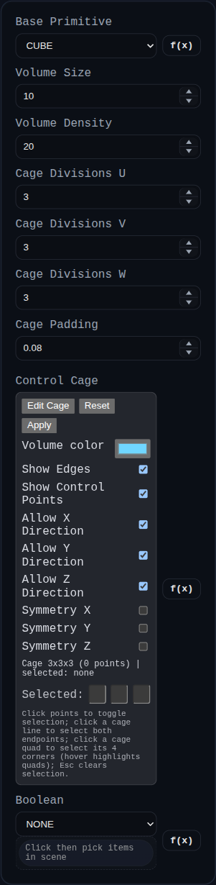
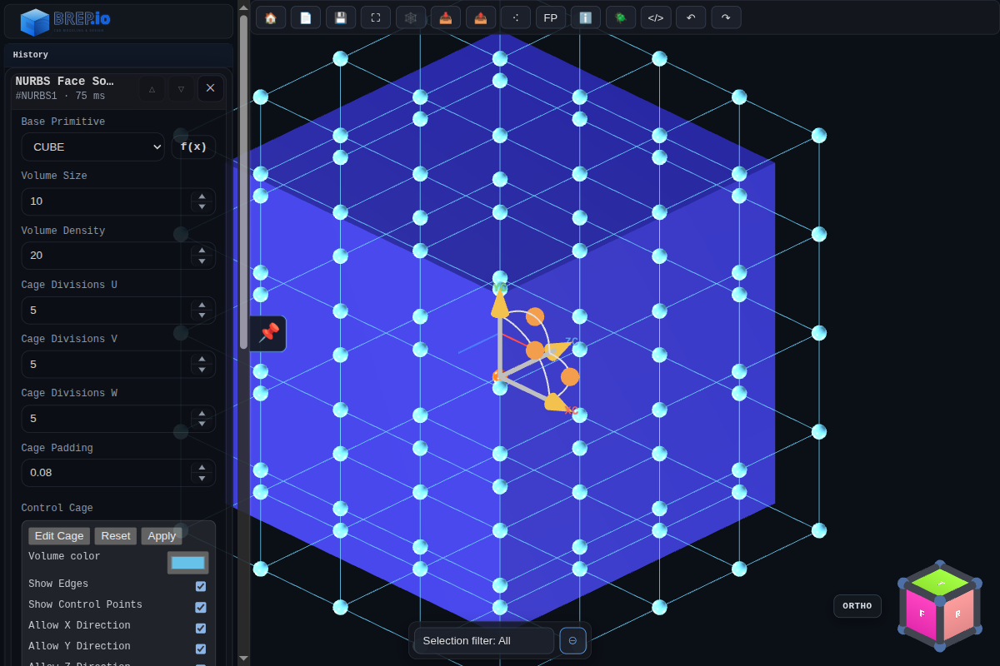

# NURBS Face Solid

Status: Implemented

## Screenshots

NURBS Face Solid creates its own base primitive volume, then deforms it with an interactive 3D control cage.

## Inputs
- `basePrimitive` – starting primitive (`CUBE`, `SPHERE`, `CYLINDER`, `TORUS`).
- `volumeSize` – base primitive size.
- `volumeDensity` – base primitive tessellation density.
- `cageDivisionsU/V/W` – cage resolution along each axis.
- `cagePadding` – default margin around the generated bounds when creating/resetting the cage.
- `cageEditor` – viewport cage editor widget (Edit/Reset/Apply + display and transform options).
- `boolean.operation` / `boolean.targets` – optional CSG with existing solids.

## Behaviour
- Generates the selected base primitive internally (no source solid selection required).
- Generates (or restores) a control cage around the primitive bounds and stores it in feature `persistentData`.
- Applies free-form deformation (FFD lattice) so cage edits reshape the final mesh.
- Rebuilds the deformed mesh live while cage points are edited.
- Preserves cage point positions when `basePrimitive` or `volumeDensity` are changed.
- Keeps control points screen-size stable while zooming.

## Cage Editor
- `Edit Cage` activates viewport editing.
- Control points render as spherical handles.
- Single-click toggles a control point selection on/off.
- Clicking a cage line selects both endpoints for that line.
- Clicking a cage quad region selects all 4 corner points for that quad.
- Multi-selected points move together with the transform gizmo.
- `Allow X/Y/Z Direction` toggles gizmo translation axes.
- `Symmetry X/Y/Z` mirrors edits across enabled axes.
- `Show Edges` / `Show Control Points` toggles cage overlays.
- `Reset` rebuilds the cage around current primitive bounds.
- `Apply` commits the current cage state and reruns the feature.
- `Escape` clears cage point selection.
