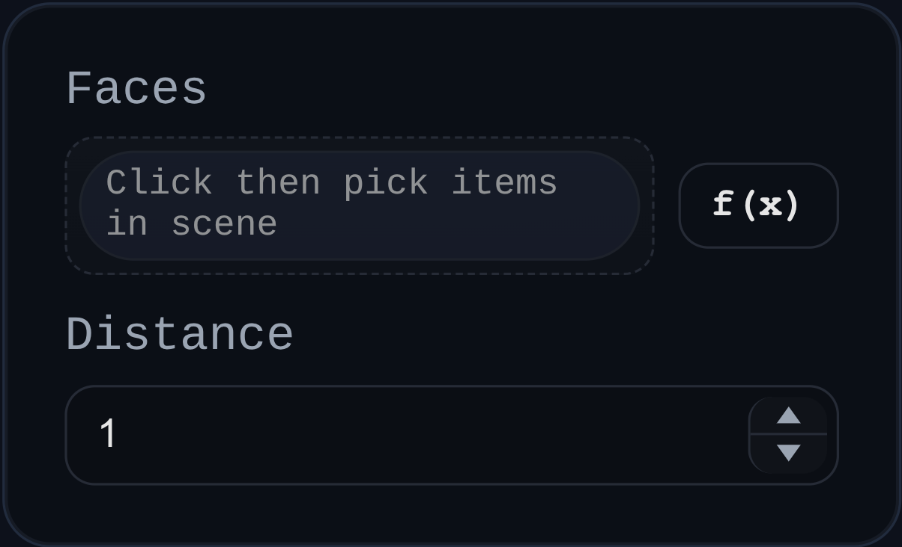

# Offset Face

Status: Implemented

Offset Face creates offset sketch geometry from selected faces. The output is sketch-like reference geometry, not a replacement solid.

## Inputs
- `faces` – one or more face selections to offset.
- `distance` – signed offset distance along each face normal.
- `id` – optional naming prefix for generated sketch groups.

## Behaviour
- Clones selected face geometry into world space, offsets by face normal, and emits a `SKETCH` group per face.
- Generates both an offset face (`...:PROFILE`) and extracted boundary edges, including loop metadata (`boundaryLoopsWorld`) for downstream consumers.
- Persists per-group basis data (`sketchBasis`) so the generated sketches behave like other planar profile sources.
- Leaves source solids untouched (`removed: []`).
