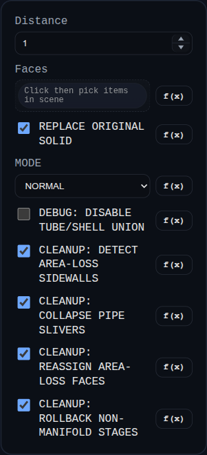

# Offset Shell

Status: Implemented

Offset Shell thickens every face of the selected faces' parent solid except the selected faces, then unions the thickened solids into one shelled result.

## Inputs
- `faces` – One or more faces to exclude while shelling the parent solid. All faces must belong to the same solid.
- `distance` – Signed shell distance. Per-face thickening uses the opposite sign, so `2` thickens by `-2` and `-3` thickens by `3`. Must be non-zero.
- `id` – Optional identifier applied to the generated shell and its faces.

## Behaviour
- Collects the solid from the selected faces; aborts if selections span multiple solids or no solid is found.
- Uses `OffsetShellSolid.generate` to thicken every non-selected face of the parent solid and boolean-union the results; leaves the original solid untouched.
- Names the result `<parentName>_<featureID>` and visualizes it for downstream selection.
