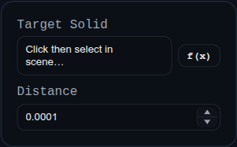

# Overlap Cleanup

Status: Implemented

Overlap Cleanup removes thin self-overlap artifacts by intersecting a solid with small axis-shifted copies of itself.

## Inputs
- `targetSolid` – the solid to process.
- `distance` – translation amount used for each axis-shifted copy.

## Behaviour
- Clones the target, creates three shifted copies (`+X`, `+Y`, `+Z`), then performs `INTERSECT` against those copies.
- Replaces the original target with the cleanup result when intersection succeeds.
- Names the first result `"<feature-or-target-name>_Overlap"` for traceability.
