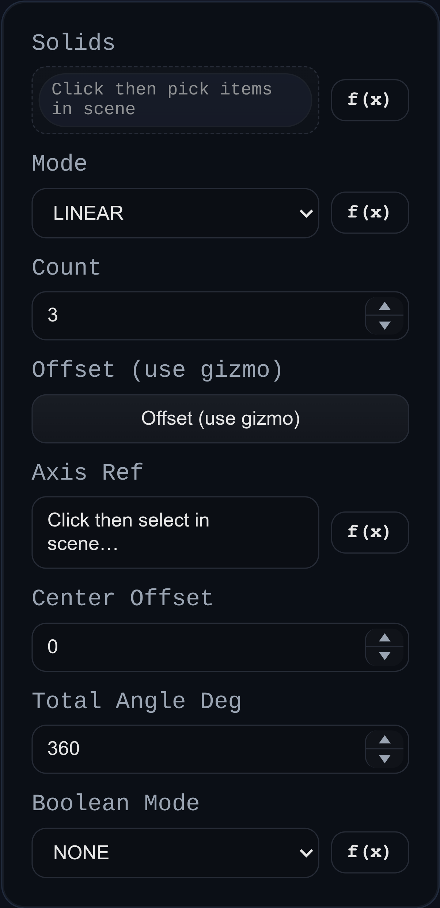

# Pattern

Status: Implemented

Pattern creates either linear or circular arrays of solids, with an option to union instances back into the source.

## Inputs
- `solids` – Solids to pattern. Face/edge selections resolve their owning solid automatically.
- `mode` – `LINEAR` or `CIRCULAR`.
- `count` – Total instances including the original (clamped to ≥1).
- `countMode` – `count and pitch` uses the distance/angle as the step between instances; `count and span` divides the distance/angle across `count - 1` intervals.
- `linearInputMode` – `transform` uses the transform gizmo offset; `vector distance` uses a selected direction reference and numeric distance. New linear patterns default to `vector distance`.
- `offset` – Transform used for linear patterns; only `position` is applied between instances.
- `directionRef` – Edge direction or face/plane normal used for linear patterns in `VECTOR_DISTANCE` mode.
- `linearDistance` – Distance between linear instances in `vector distance` mode.
- `axisRef` – Edge supplying the axis and origin for circular patterns.
- `centerOffset` – Distance along the axis from the reference origin to the pattern center.
- `totalAngleDeg` – Circular angle value. In `count and pitch` mode it is the per-step angle; in `count and span` mode it is the total span.
- `booleanMode` – `NONE` returns separate bodies; `UNION` fuses clones into the source and removes the originals.

## Behaviour
- Linear mode translates clones by either `offset.position * instanceIndex` or `directionRef * linearDistance * instanceIndex`; in `count and span` mode that offset is divided by `count - 1`.
- Circular mode rotates clones about the selected edge axis and center. In `count and pitch` mode each copy advances by the entered angle; in `count and span` mode the angle is divided by `count - 1`.
- When `booleanMode` is `UNION`, clones are merged into each source solid and the originals are flagged for removal; otherwise all clones are returned as separate solids.
- Face names on clones are retagged with the feature ID to keep downstream selections stable even when booleaned together.
