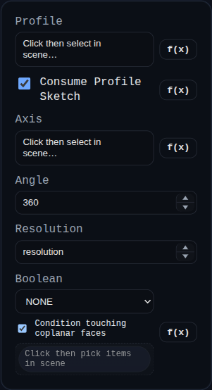

# Revolve

Status: Implemented

Revolve sweeps a face or sketch profile around an edge-defined axis to create lathe-style solids.

## Inputs
- `profile` – a face or sketch containing a face.
- `consumeProfileSketch` – when `true` (default), removes the source sketch after a successful revolve.
- `axis` – an edge that defines the rotation axis. The feature samples the edge polyline/geometry in world space.
- `angle` – revolution angle in degrees (0–360). Values below 360 create end caps.
- `resolution` – segment count used for the rotational sweep tessellation.
- `boolean` – optional union/subtract/intersect against other solids.

## Behaviour
- Boundary loops are read from the profile’s metadata when available so holes remain aligned; otherwise edge polylines are sampled.
- The feature builds start/end caps for partial revolves and names side faces using the first profile’s edge labels.
- After the revolve solid is created the optional boolean helper runs. Source sketches are flagged for removal when `consumeProfileSketch` is enabled, and consumed boolean operands are removed automatically.
