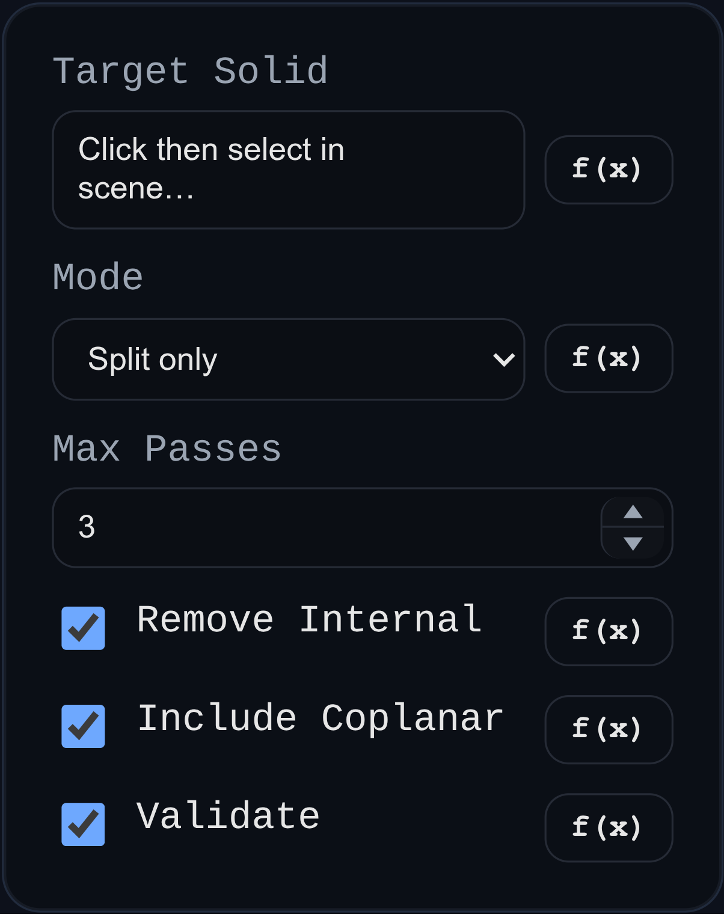

# Self Intersection Cleanup

Self Intersection Cleanup attempts to repair self-intersecting mesh regions on selected solid geometry.

Use it after imports, aggressive surfacing edits, or thickening operations when diagnostics or downstream operations indicate intersecting triangles inside a solid.

## Workbench Availability

Available in Modeling, Surfacing, and All.

## Related
- [Overlap Cleanup](./overlap-cleanup.md)
- [Solid Overlap Diagnostics](../tools/solid-overlap-diagnostics.md)
