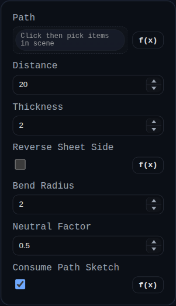

# Sheet Metal Contour Flange

Status: Implemented (engine-backed)

Contour Flange builds a base sheet-metal tree from an open path (sketch/edge chain) and evaluates it using the shared deterministic sheet-metal core.

## Inputs
- `path` – Connected edge chain (from sketch, edges, or face boundaries).
- `distance` – Strip width offset from the path.
- `thickness` – Global model thickness.
- `reverseSheetSide` – Flips offset side and placement direction.
- `bendRadius` – Default inside bend radius stored for downstream operations.
- `neutralFactor` – Default k-factor stored for downstream operations.
- `consumePathSketch` – Removes source sketch group when enabled.

## Behavior
- Converts the selected path into a strip-like root `FlatSurface`.
- Evaluates the resulting tree to produce synchronized folded 3D and unfolded 2D representations.
- Adds selectable face/edge overlays tagged with `flatId/edgeId` for downstream flange/hem targeting.
- Persists tree and root transform in `persistentData.sheetMetal`.
