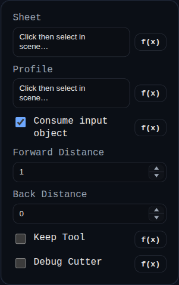

# Sheet Metal Cutout

Status: Implemented (engine-backed)

Sheet Metal Cutout removes material from an existing sheet-metal model using a sketch/face/solid profile.

## Inputs
- `sheet` – target sheet-metal solid (or a face/edge on that solid).
- `profile` – sketch, face, or external solid used as the cutout profile/tool.
- `consumeProfileSketch` – removes source sketch after success when enabled.
- `forwardDistance` / `backDistance` – profile extrusion depth controls (for sketch/face profiles).
- `keepTool` – keeps the generated cutter solid in scene.
- `debugCutter` – keeps internal cleanup cutter for diagnostics.

## Behaviour
- Resolves sheet-metal source from explicit `sheet` selection (with fallback resolution when possible).
- Rejects invalid self-references (for example selecting a face from the same target sheet body as the profile).
- Attempts midplane/tree-native cut mapping first; for eligible solid tools it can fall back to legacy boolean-recorded cutouts.
- Rebuilds and replaces the sheet-metal model, persists cutout summaries in `persistentData.sheetMetal`, and optionally keeps cutter bodies for debugging.
