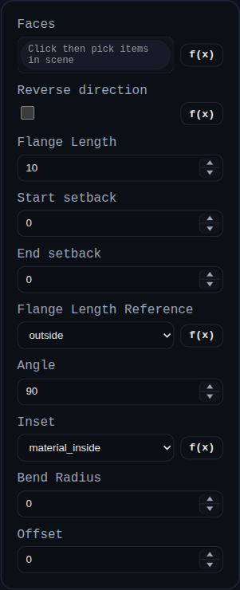

# Sheet Metal Flange

Status: Implemented (engine-backed)

Sheet Metal Flange extends an existing sheet-metal tree by attaching bend children to selected sheet-metal edge overlays.

## Inputs
- `faces` – Select sheet-metal `EDGE` overlays (or flat `FACE` overlays) from an existing sheet-metal model.
- `angle` – Bend angle relative to the parent flat.
- `useOppositeCenterline` – Flips bend direction by changing bend angle sign.
- `flangeLength` – Child flat leg length.
- `flangeLengthReference` – Interprets `flangeLength` as `inside`, `outside`, or `web` distance and converts to the engine’s tangent-based web leg.
- `inset` – Controls parent-edge repositioning in 2D before bend creation:
  `material_inside = thickness + bendRadius`,
  `material_outside = bendRadius`,
  `bend_outside = 0`.
- `bendRadius` – Inside bend radius override.
- `offset` – Additional signed bend-edge offset (positive = outward, negative = inward).
- `neutralFactor` – K-factor override.

## Behavior
- Reads the source `SheetMetalTree` from the selected sheet-metal model.
- Resolves selected edge targets by stable `flatId/edgeId` metadata.
- For `inset`/`offset`, rewrites the parent flat loop by moving the target bend edge (`material_inside = t + r`, `material_outside = r`, `bend_outside = 0`) and inserting bridge edges so the flat remains closed.
- For `flangeLengthReference`, adjusts the child web leg length from inside/outside/web reference to tangent-based leg length.
- Adds deterministic bend + child-flat nodes, then re-evaluates 3D and 2D outputs with the shared engine.
- Replaces the previous sheet-metal model object in scene with the updated one.
- Stores updated tree and evaluation summary in `persistentData.sheetMetal`.

## Hem Variant
`Sheet Metal Hem` reuses the same pipeline with an angle override of `180°` and a small default bend radius.
