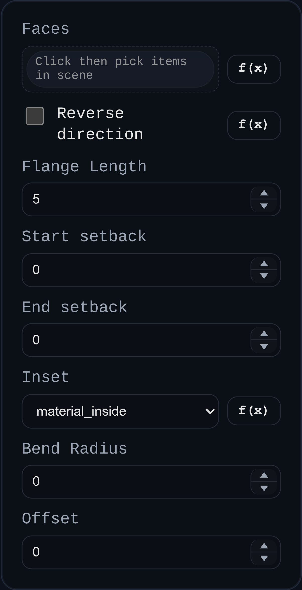

# Sheet Metal Hem

Status: Implemented (engine-backed)

Sheet Metal Hem reuses the flange pipeline with a fixed `180°` fold to create hemmed edges on an existing sheet-metal model.

## Inputs
- `faces` – sheet-metal edge/face overlays to hem.
- `useOppositeCenterline` – flips fold direction.
- `flangeLength` – hem leg length.
- `edgeStartSetback` / `edgeEndSetback` – trim hem span back from selected edge endpoints.
- `inset` – edge reposition mode before bend creation (`material_inside`, `material_outside`, `bend_outside`).
- `bendRadius` – inside bend radius override.
- `offset` – signed bend-edge offset.

## Behaviour
- Resolves selected overlays back to stable sheet-metal tree targets.
- Adds deterministic bend/child-flat nodes using a locked `180°` angle.
- Re-evaluates folded 3D and flat 2D outputs through the shared sheet-metal engine.
- Replaces the prior sheet-metal model object and stores updated tree/evaluation data in `persistentData.sheetMetal`.
