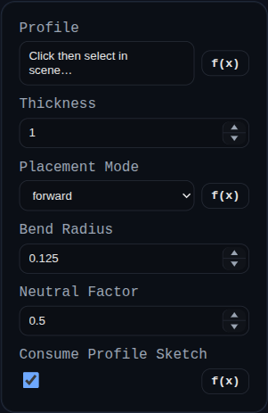

# Sheet Metal Tab

Status: Implemented (engine-backed)

Sheet Metal Tab seeds a deterministic sheet-metal tree from a sketch/face profile and evaluates it with the shared sheet-metal core engine.

## Inputs
- `profile` – Closed sketch or face used to derive the root flat.
- `thickness` – Global sheet thickness for the model tree.
- `placementMode` – `forward`, `reverse`, or `midplane` placement relative to the profile plane.
- `bendRadius` – Default inside bend radius stored for downstream flange/hem features.
- `neutralFactor` – Default k-factor stored for downstream bend allowance.
- `consumeProfileSketch` – Removes the source sketch group after creation when enabled.

## Behavior
- Converts the selected profile into a root `FlatSurface` and stores a deterministic `SheetMetalTree`.
- Evaluates the tree via the imported sheet-metal engine to generate folded 3D and unfolded 2D representations.
- Emits selectable flat/edge overlays linked to tree IDs so downstream features can target explicit edges.
- Persists the tree/root transform in feature `persistentData.sheetMetal`.
