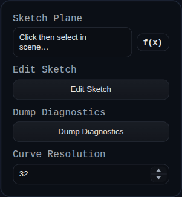

# Sketch

Status: Implemented

Sketch stores 2D geometry in feature-persistent data and visualises it on a selected plane or face. The sketch mode opens a 2D sketcher environment where you can draft profiles that become the basis for Extrude, Revolve, Loft, or Sweep features.

## Overview

Sketch Mode opens the 2D sketcher on a selected plane or face. Geometry is constrained within a local coordinate system, letting you dimension lines, arcs, and splines precisely. When you finish, the sketch remains parametric and updates downstream features as you edit it later.

## Workflow

1. Choose a plane or datum, then activate Sketch Mode from the feature history
2. Draw with line, rectangle, circle, arc, spline, and text tools
3. Apply constraints and dimensions to lock intent before returning to Modeling Mode
4. Refine profiles with Trim, construction toggles, and spline edits
5. Use the sketch as input for other features like Extrude, Revolve, Sweep, or Loft

## Tool Icons
Sketch Mode uses Unicode icon buttons for quick tool switching. The top toolbar includes:

| Icon | Tool | What it does |
| --- | --- | --- |
| 👆 | Select | Select and edit sketch points, curves, and constraints. |
| ✂ | Trim | Trim a curve at the nearest intersection(s) around the click. |
| ⌖ | Point | Create a point on the sketch plane. |
| / | Line | Create a line between two points. |
| ☐ | Rectangle | Create a rectangle from two corner points. |
| ◯ | Circle | Create a circle from center → radius point. |
| ◠ | Arc | Create an arc from center → start → end. |
| ∿ | Bezier | Create a cubic Bezier (end0 → ctrl0 → ctrl1 → end1). |
| 🔗 | Link external edge | Project edge endpoints into the sketch as fixed points. |
| ↶ | Undo | Undo the last sketch operation. |
| ↷ | Redo | Redo the last undone sketch operation. |

## Inputs
- `sketchPlane` – face or datum plane that defines the sketch basis. The plane orientation updates automatically when the reference moves.
- `Edit Sketch` – opens the in-app sketcher (`viewer.startSketchMode`) so you can add points, curves, and constraints.
- `curveResolution` – tessellation setting used when generating circular geometry for downstream features.

## Behaviour
- The feature builds a local coordinate frame from the selected plane, saves it in persistent data, and reuses it on every regenerate so the sketch tracks its reference.
- Sketch geometry is kept as JSON, solved through the `ConstraintEngine`, and rendered as a `SKETCH` group containing faces and edges that other features (Extrude, Revolve, Sweep) can consume.
- External references are projected into sketch space at regenerate time and expression-backed dimensions are evaluated before solving.

## Constraints
Sketch constraints show up as glyphs that use Unicode icons so you can tell them apart at a glance. The solver supports the following set:

| Symbol | Constraint | What it does |
| --- | --- | --- |
| ⏚ | Ground | Locks a point in place. Used for the origin and any projected references so they cannot be dragged. |
| ━ | Horizontal | Forces two selected points to share the same `y` value. |
| │ | Vertical | Forces two selected points to share the same `x` value. |
| ≡ | Coincident | Merges two points so they occupy the same coordinates; downstream coincident groups stay merged. |
| ⟺ | Distance | Adds a numeric dimension. On lines it fixes the segment length, on arcs/circles it becomes a radius or diameter dimension. |
| ⇌ | Equal Distance | Makes two segments (or two radii) match length. Works for line pairs or circular features that need equal radii. |
| ∥ | Parallel | Keeps two lines travelling in the same direction, reusing existing horizontal/vertical locks when possible. |
| ⟂ | Perpendicular / Tangent | For line pairs it enforces a 90° angle. When applied between a line and a circle/arc it constrains the line to stay tangent by keeping the radius perpendicular at the contact point. |
| ∠ | Angle | Stores an explicit angle between two segments. The initial value is captured from the current sketch state. |
| ⏛ | Point on Line | Projects a point onto the line defined by the first two selections, useful for keeping construction points collinear. |
| ⋯ | Midpoint | Centers the third point midway between the first two and retains equal distances as you edit the sketch. |

Grouped constraints that touch the same points share a single anchor and render their glyphs side by side so complex regions stay legible.

## Context Toolbar
A floating context toolbar follows the sketch viewport and updates itself based on the active selection. It offers only the constraints and actions that apply to the selected entities, making it quick to add intent without digging through menus.

- **Adaptive constraints** – Select two line segments and the toolbar lights up `Parallel ∥`, `Perpendicular ⟂`, `Angle ∠`, and `Equal Distance ⇌`. Pick a line and an arc and it switches to the tangent option. Single, double, or triple point selections surface the matching point-based constraints (`H ━`, `V │`, `Coincident ≡`, `Distance ⟺`, `Colinear ⏛`, etc.).
- **Radial dimensions** – Selecting a single circle or arc reveals `Radius` and `Diameter` dimension buttons so you can drop the right measurement without changing tools.
- **Construction toggle** – Any time geometry is highlighted the toolbar shows a toggle that flips the selection between regular sketch curves and construction geometry. Construction curves remain in the sketch for constraints but are ignored when profiles are consumed by downstream features.
- **Fix / Unfix** – When one or more points are selected the toolbar offers a fast fix toggle, adding or removing `⏚` constraints without opening the constraint picker.
- **Cleanup & delete** – The toolbar always offers a cleanup button (🧹) to remove orphan points, and shows delete actions when a selection is active.

### Context Action Icons
| Icon | Action | Notes |
| --- | --- | --- |
| ◐ | Construction toggle | Switch selected curves between construction and regular geometry. |
| 🧹 | Cleanup | Remove orphan points that are unused by geometry and lightly constrained. |
| 🗑 | Delete | Remove the current selection. |
| R | Radius | Create a radius dimension on an arc/circle. |
| ⌀ | Diameter | Create a diameter dimension on an arc/circle. |

## Trim Tool
Trim removes the clicked segment of a curve using the closest intersection(s) around the cursor.

- **Activation** – Choose the ✂ Trim tool from the top toolbar, then click the curve segment you want to remove.
- **Supported geometry** – Lines, arcs, circles, and Bezier splines can be trimmed.
- **Local splitting** – Trim only splits at the nearest intersection(s) around the click, not at every intersection along the curve.
- **Closed curves** – Circles (and full arcs) keep the segment opposite the clicked section.
- **Degenerate cases** – If a curve lies on top of another curve or an endpoint already sits on another curve and no valid trim bounds exist, Trim removes the curve entirely.
- **Constraint preservation** – When trimming against a line, the new trim point is constrained colinear to the cutting line (or coincident if it lands on the cutting line endpoint). For arcs/circles, trim points receive an equal‑distance constraint from the center to preserve the radius. Splines currently trim without adding constraints.

## Spline (Bezier) Editing
The sketcher includes direct Bezier editing with construction‑line helpers.

- **Creation** – The ∿ tool creates a cubic Bezier using four points: end0 → ctrl0 → ctrl1 → end1.
- **Construction guides** – After creation, construction lines connect each endpoint to its adjacent handle so you can constrain handles with regular sketch constraints.
- **Insert point** – With the Bezier tool active, clicking near an existing Bezier inserts a new anchor at the closest location. The curve is split using de Casteljau so its shape is preserved, and new handle points plus construction guides are added.

## Visual Feedback
- **Under‑constrained points** – Points that are not fixed and are not referenced by any non‑temporary constraint are rendered in orange to flag areas that still need intent.

## Solver Settings
The sketch sidebar exposes solver settings for iteration count, tolerance, and decimal precision. It also includes:

- **Auto‑remove orphan points (default on)** – After delete and trim operations, the sketcher removes points that are not used by any geometry and either have no constraints or only a single coincident/point‑on‑line constraint. This is the same logic used by the 🧹 cleanup action in the context toolbar.

## Linking External Geometry
Sketch Mode can link to edges that live outside the current sketch so profiles stay tied to upstream solids:

1. Switch to the sketch and pick `Link external edge` on the top toolbar.
2. Click scene edges or face boundaries; each pick projects both endpoints into sketch UV space and adds them as fixed points.
3. The viewer lists every linked edge; selecting a row reselects its projected points, and `Unlink` removes the pair and their auto-created ground constraints.

The sketch feature stores external links as `externalRefs` in persistent data. On every regenerate it looks up the referenced edge by id or name, reprojects the endpoints into the sketch plane, and reapplies `⏚` constraints so the references remain locked. If the source geometry moves, the sketch updates automatically, keeping downstream features live without requiring you to redraw or manually re-reference the outline.
