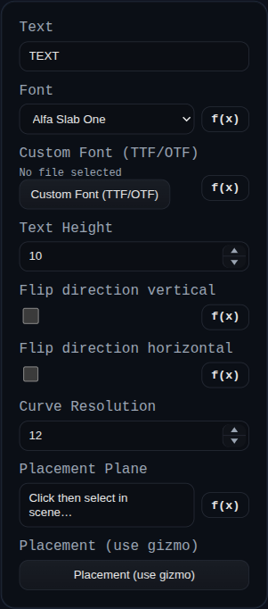

# Text to Face

Text to Face converts a text string into a sketch-like face that can be used downstream (Extrude, Revolve, Sweep, Loft). It generates planar faces and edges from a font outline and places the result on a selected plane or face.

## Workflow
1. Add **Text to Face** from the feature list.
2. Enter the text string.
3. Choose a font (built-in or upload a custom TTF/OTF).
4. Set the text height and curve resolution.
5. Pick a placement plane or face.
6. Use the transform gizmo to position/rotate the text.
7. Finish and use the resulting sketch in other features (Extrude, Revolve, etc.).

## Inputs
- `text` — Text string to convert into a face.
- `font` — Built-in font selection (includes bundled Google Fonts + system fonts).
- `fontFile` — Optional custom font override (`.ttf` or `.otf`).
- `textHeight` — Height of the text in world units.
- `flipDirectionVertical` — Flip the text vertically within the sketch plane.
- `flipDirectionHorizontal` — Flip the text horizontally within the sketch plane.
- `curveResolution` — Curve tessellation density (segments per curve).
- `placementPlane` — Plane or face that defines the sketch plane.
- `transform` — Gizmo-based placement relative to the selected plane/face.

## Output
- A `SKETCH` group containing a triangulated face plus edge polylines.
- The output behaves like other sketches: it can be consumed directly by Extrude/Revolve/Sweep/Loft.

## Tips
- Lower `curveResolution` for faster rebuilds; increase it for smoother curves.
- Use the flip controls for mirrored labels or stamped text.
- Built-in Braille HC options include `Braille Grid HC`, `Braille Latin HC`, `Braille Pinboard HC`, and `Braille Pixel HC` (font rendering only; no runtime character remapping code).
- Use `fontFile` if you need a different Braille convention or style.
- If a font fails to load, try a different file or remove exotic glyphs from the text string.
