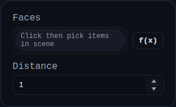

# Thicken

Status: Implemented

Thicken converts one or more selected open faces into individual closed solids by offsetting each face along its local normals and stitching side walls around every boundary loop.

## Inputs
- `face` – one or more face selections. Sketch selections that resolve to a face are also accepted.
- `distance` – signed thickness along the face normals. Must be non-zero.
- `id` – optional identifier used as the result name for a single face, or as the prefix for multi-face outputs.

## Behaviour
- Resolves each selection to a `FACE` object, deduplicating repeated picks.
- Calls `face.thicken(distance, { featureId, name })` for each resolved face.
- Produces one new solid per selected face and leaves the source geometry untouched.
- Stores per-result diagnostics in feature `persistentData` and on each returned solid under `__thickenDiagnostics` and `userData.thicken`.

## Result Naming
- Single-face thickens use the feature ID as the solid name.
- Multi-face thickens generate one solid per face using `<featureId>_<index>_<sourceFaceName>`.
- Kernel face labels follow the source face name:
  - `<sourceFaceName>_START` for the original-side cap
  - `<sourceFaceName>_END` for the offset cap
  - `<sourceFaceName>_SW` for the first side wall loop
  - `<sourceFaceName>_L<n>_SW` for additional side wall loops

## Notes
- Positive and negative distances are both supported.
- Faces with holes generate one side wall per boundary loop.
- Curved faces are supported; the output remains a closed manifold solid when the kernel can classify and stitch the shell successfully.
- Each selected face becomes its own solid. This feature does not merge multiple thickened faces into one body.
- Source face metadata is propagated onto the generated start/end cap faces when available.

## Related Kernel API
- UI feature implementation: `src/features/thicken/ThickenFeature.js`
- Face method entrypoint: `Face.thicken(distance, options)` in `src/BREP/Face.js`
- Kernel implementation: `thickenFaceToSolid(face, distance, options)` in `src/BREP/faceThicken.js`

## Covered Scenarios
The test suite currently covers:
- planar sketch profiles
- profiles with holes
- curved cylindrical side faces
- planar faces with filleted boundaries
- negative-distance/self-overlap cases
- partial torus side faces
- feature serialization and replay
- multi-face output naming and persistence

See `src/tests/test_thickenFeature.js` for executable examples of the current behavior.
