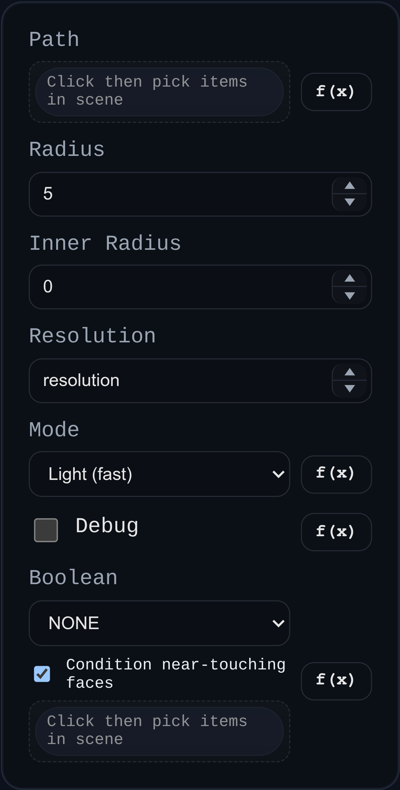

# Tube

Status: Implemented

Builds a tubular solid along one or more connected path edges, with optional hollow core and optional downstream boolean operation.

## Inputs
- `path` – one or more `EDGE` references that form the tube centerline.
- `radius` – outer radius (must be positive).
- `innerRadius` – optional hollow radius (`0` creates a solid tube).
- `boolean` – optional union/subtract/intersect against selected solids.

## Behaviour
- Resolves and chains selected edge polylines into one or more connected paths.
- Generates tube bodies with OpenCascade `BRepOffsetAPI_MakePipe` from a swept circular profile face.
- Produces hollow tubes by sweeping a single annular profile when `innerRadius > 0`.
- Applies the optional boolean operation through the shared helper and returns only resulting solids.
