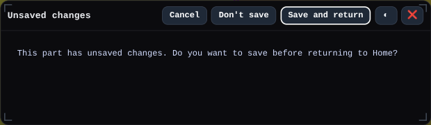
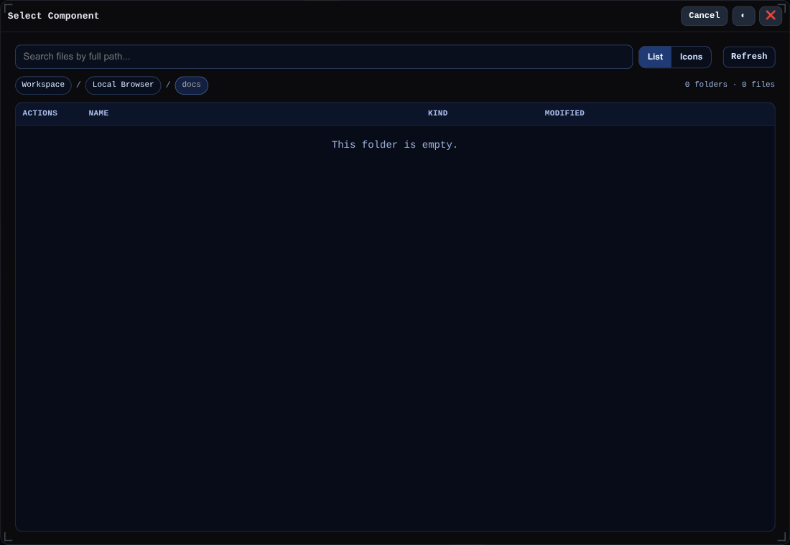

# Floating Windows

These screenshots are generated by `pnpm capture` from the `docs` capture target. They cover the UI built on `FloatingWindow`, including the export, inspection, diagnostics, sheet-metal, testing, plugin, file, and wire-harness windows.

## Export And Sharing

## Inspection And Diagnostics

## Sheet Metal

## Automation And Testing

## Files, Components, And Plugins

## Wire Harness

