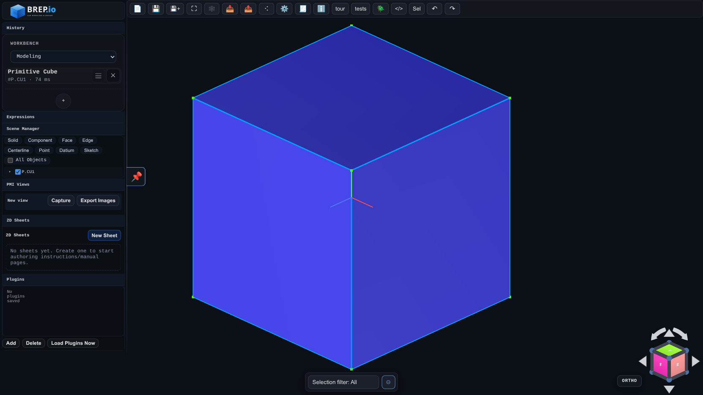

# Modeling Mode

Modeling Mode is the default workspace for solid construction. The scene shows the active history tree, 3D viewport, and main toolbar controls. Add primitives, booleans, and editing features to the timeline, then drag or edit them to re-run the part. Selection filters and gizmos in this mode operate directly on bodies, faces, and edges to drive feature inputs.

## Live Demos
- Examples hub: [https://BREP.io/apiExamples/index.html](https://BREP.io/apiExamples/index.html)
- Embeded CAD: [https://BREP.io/apiExamples/Embeded_CAD.html](https://BREP.io/apiExamples/Embeded_CAD.html)

Key tools:
- Main toolbar (Save, Zoom to Fit, Wireframe, Import/Export, About)
- Feature history panel for creating primitives, sketches, and operations
- Expressions panel for global variables and configurator widgets
- Inspector for per-face metrics like area and owning feature

The Expressions panel supports two related workflows:

- `expressions`: a shared JavaScript-style scratchpad for variables such as `width = 20;`
- `configurator`: a UI-driven set of widgets (`slider`, `number`, `select`, `string`) whose values are injected into expressions as `configurator.fieldName`

If configurator widgets exist, the generated configurator form appears above the expression editor. Those values are stored in part history, survive save/load, and can be referenced by feature dialogs through normal expression entry.

Use Modeling Mode to position solids, apply patterns, and manage global transforms before switching to specialized modes.
