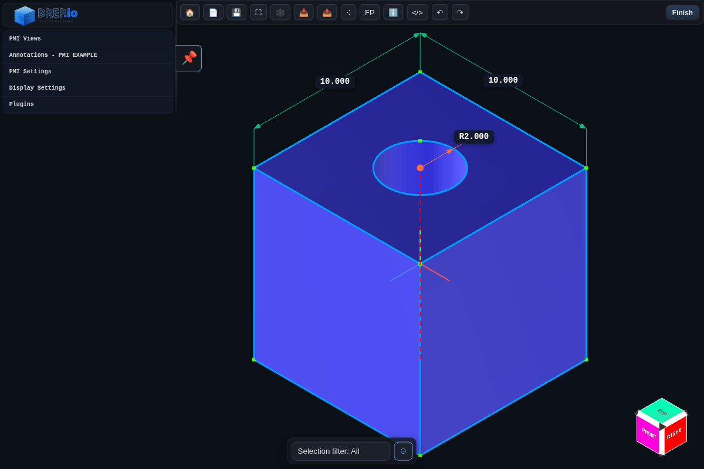

# PMI Mode

PMI (Product Manufacturing Information) Mode focuses on annotations, dimensions, and callouts. Activate it to place linear, radial, angular, and leader dimensions that communicate manufacturing intent without altering the underlying solid.

## Live Demos
- Examples hub: [https://BREP.io/apiExamples/index.html](https://BREP.io/apiExamples/index.html)
- Embeded CAD: [https://BREP.io/apiExamples/Embeded_CAD.html](https://BREP.io/apiExamples/Embeded_CAD.html)

Capabilities:
- Place linear, radial, and angular dimensions with associative snapping to faces or edges
- Add leader annotations that reference points, faces, or datums
- Configure formatting through the PMI inspector and label overlay panels
- Stage exploded views with view-specific transforms that leave the model untouched
- Export PMI views as labeled PNGs directly from the PMI Views panel

Use PMI Mode after modeling is complete to capture critical tolerances, notes, and inspection data directly on the 3D model.

## Views and Export

- Capture a PMI view from the PMI Views panel to store the current camera, display settings, and its annotation list.
- Click **Export Images** in the same panel to render labeled PNGs for every saved view; the exporter replays each view, applies its stored annotations, and grabs a canvas snapshot for you.
- When you export a 3MF file, the view definitions ride along inside `Metadata/featureHistory.json`, and the generated PNGs are attached under `/views/<view-name>.png` in the archive so downstream tools can inspect or relink them.

## Annotation Library

- [Linear Dimension](../pmi-annotations/linear-dimension.md)
- [Radial Dimension](../pmi-annotations/radial-dimension.md)
- [Angle Dimension](../pmi-annotations/angle-dimension.md)
- [Hole Callout](../pmi-annotations/hole-callout.md)
- [Leader](../pmi-annotations/leader.md)
- [Note](../pmi-annotations/note.md)
- [Explode Body (View Transform)](../pmi-annotations/explode-body.md)
