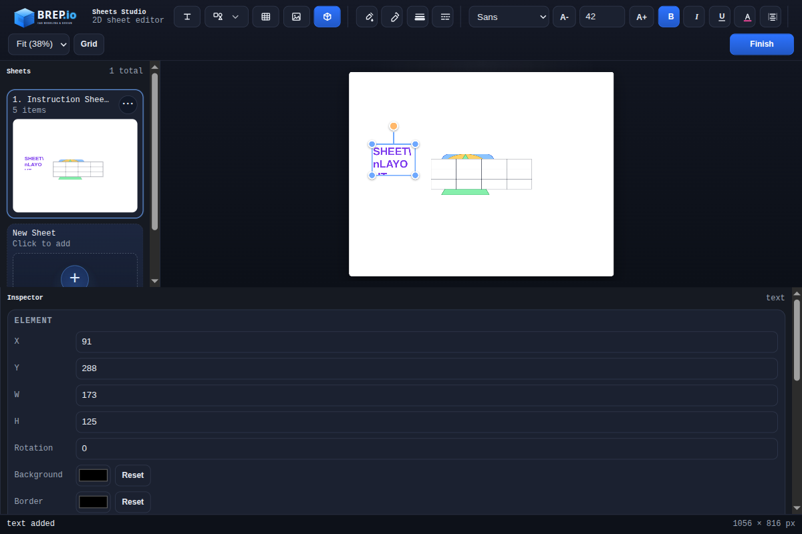
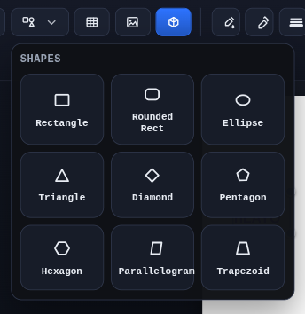
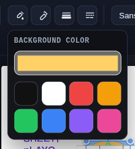
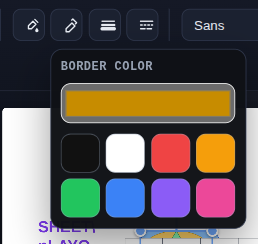
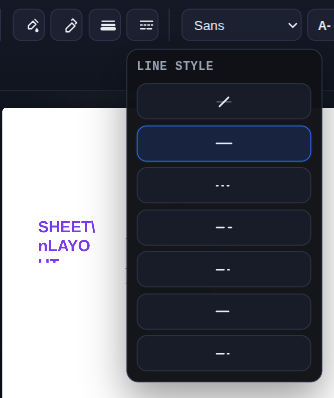
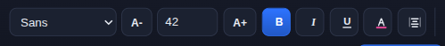
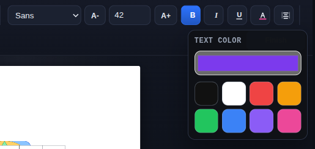
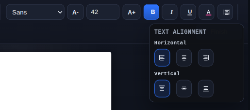

# 2D Sheets Mode

2D Sheets Mode is the full-screen layout editor for building instruction sheets, inspection sheets, and presentation-style drawing pages on top of the current model. It combines freeform sheet graphics with live PMI view insets, tables, text, and reusable multi-sheet layouts.

## What It Does
- Add `Text`, `Shapes`, `Tables`, `Images`, and live `PMI Views` to the active sheet.
- Move, resize, rotate, layer, duplicate, and delete sheet objects directly on the page.
- Apply fill color, border color, line weight, line style, text color, font family, font size, bold, italic, underline, and text alignment from the top toolbar or inspector.
- Build multiple sheets, switch between them from the sidebar, and duplicate or reorder sheets as needed.
- Keep PMI views associative with the model so captured views update when the source PMI view changes.

## Selection And Editing
- `Shift`-click adds or removes objects from the current selection.
- `Ctrl/Cmd+G` groups the current selection. `Shift+Ctrl/Cmd+G` ungroups it.
- Double-click a grouped object to enter the group and edit its members individually.
- Press `Esc` to exit group editing.
- `Ctrl/Cmd+C` and `Ctrl/Cmd+V` copy and paste selected objects between sheets inside the sheet editor.

## Object Types
- **Text**: freeform text blocks with multiline editing.
- **Shapes**: rectangle, rounded rectangle, ellipse, triangle, diamond, pentagon, hexagon, parallelogram, and trapezoid.
- **Tables**: resizable grid objects with per-cell editing, row/column insertion, merge/unmerge, and spreadsheet paste support.
- **Images**: bitmap placement with locked-aspect resizing and crop mode.
- **PMI Views**: live model snapshots with optional labels and anchor-controlled refresh behavior.

## Toolbar

Insert tools:

Shapes menu:

Shape styling toolbar:

Fill menu:

Stroke menu:

Line weight menu:

Line style menu:

Text formatting toolbar:

Text color menu:

Text alignment menu:

## Tables
- Drag the table border to resize the overall table.
- Drag column handles to change column widths.
- Right-click table cells to insert rows or columns.
- Merge and unmerge cell ranges from the same context menu.
- Paste tabular content from Excel or Google Sheets directly into a selected table or into an empty sheet to create a new table.

## PMI Views On Sheets
- Insert PMI views from the current part without leaving the sheet editor.
- The inset preserves aspect ratio and uses the stored trimmed view image instead of manual crop editing.
- A selectable anchor point controls which corner, edge midpoint, or center stays fixed when the source PMI view refreshes.

## Typical Workflow
1. Capture or update PMI views in PMI Mode if you need model callouts.
2. Open 2D Sheets Mode from the `2D Sheets` section.
3. Add sheet content such as titles, notes, shapes, tables, and PMI views.
4. Group repeated layouts, then double-click into groups when you need to adjust individual members.
5. Copy reusable content to other sheets and finish when the layout is complete.
