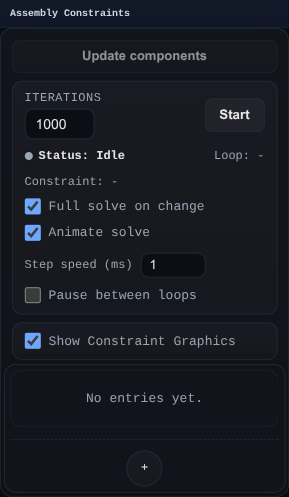

# Assembly Constraints Panel

The Assembly Constraints panel manages assembly relationships between components.

Use it to create and inspect coincident, distance, angle, fixed, parallel, and touch-align constraints.

## Workbench Availability

Available in Assemblies, Wire Harness, and All.

## Related
- [Assemblies Workbench](../workbenches/assemblies.md)
- [Assembly Constraints Solver](../assembly-constraints/solver.md)
