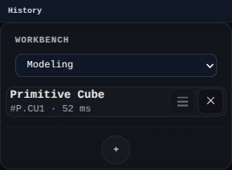

# Feature History Panel

The Feature History panel lists the model's feature sequence and provides the filtered `+` menu for the active workbench.

Use this panel to add features, inspect the history order, edit feature inputs, and switch workbenches.

## Workbench Availability

Available in Modeling, Import, Surfacing, Sheet Metal, Assemblies, Wire Harness, PMI, and All.
