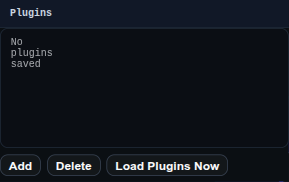

# Plugins Panel

The Plugins panel manages saved plugin URLs and plugin loading state.

Use it to add, remove, enable, disable, and load plugin sources.

## Workbench Availability

Available in Modeling, Import, Surfacing, Sheet Metal, Assemblies, Wire Harness, PMI, and All.

## Related
- [Plugins and Examples](../plugins.md)
