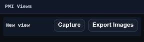

# PMI Views Panel

The PMI Views panel stores camera snapshots and annotation views for Product Manufacturing Information workflows.

Use it to capture, update, open, and export PMI views. Saved views can also be used by 2D Sheets.

## Workbench Availability

Available in Modeling, Import, Surfacing, Sheet Metal, Assemblies, Wire Harness, PMI, and All.

## Related
- [PMI Workbench](../workbenches/pmi.md)
- [PMI Annotations](../pmi-annotations/index.md)
