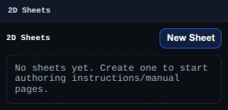

# 2D Sheets Panel

The 2D Sheets panel manages sheet documents and opens the full sheet editor.

Use it to create or open sheets for presentation layouts, tables, notes, images, and PMI view placement.

## Workbench Availability

Available in Modeling, Import, Surfacing, Sheet Metal, Assemblies, Wire Harness, PMI, and All.

## Related
- [2D Sheets Mode](../modes/sheets.md)
