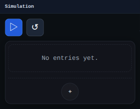

# Simulation Panel

The Simulation panel is the sidebar control surface for the Simulation workbench.

Use it to inspect simulation state and drive simulation-specific operations exposed by the simulation runtime.

## Workbench Availability

Available in Simulation and All.
