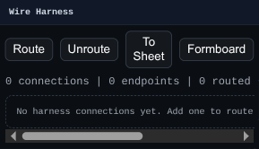
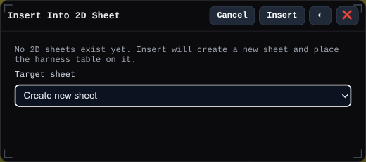

# Wire Harness Panel

The Wire Harness panel manages connection rows for routed wire runs.

Use it to add wires, assign From and To ports, set diameters, run routing, inspect length/status, and insert the current connection list into a 2D sheet.

## Workbench Availability

Available in Wire Harness and All.

## Related
- [Wire Harness Workbench](../workbenches/wire-harness.md)
- [2D Sheets Mode](../modes/sheets.md)
