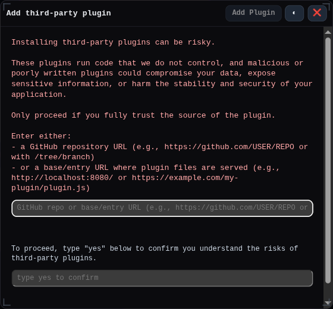
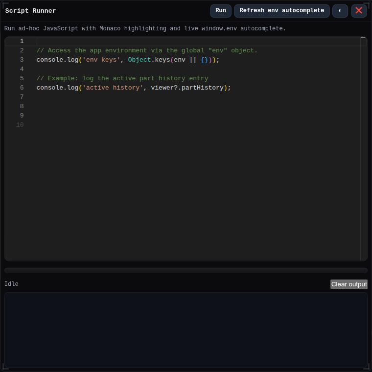

# Plugins and Examples

Use the plugin system to extend BREP with custom features, toolbar buttons, or automation pipelines sourced from GitHub.

## Example Plugin
- Repository: https://github.com/mmiscool/BREPpluginExample
- README: https://github.com/mmiscool/BREPpluginExample/blob/master/README.md
- Entrypoint: https://github.com/mmiscool/BREPpluginExample/blob/master/plugin.js
- Feature example: https://github.com/mmiscool/BREPpluginExample/blob/master/exampleFeature.js

When adding dialogs for a plugin feature, follow the shared [Input Params Schema](./input-params-schema.md) for field types, defaults, and reference-selection rules.

## Script Runner

The Script Runner floating window is available for ad-hoc JavaScript automation against `window.env` and the current viewer.

