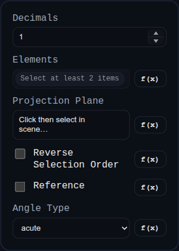

# Angle Dimension

Status: Implemented

Angle dimensions report the sweep between two selected faces/edges in PMI mode.

## Inputs
- `id` – optional annotation identifier.
- `targets` – exactly two references (`FACE` or `EDGE`).
- `planeRefName` – optional projection plane/face override.
- `reverseElementOrder` – swaps target order to flip the measured side.
- `angleType` – `acute`, `obtuse`, or `reflex`.
- `isReference` – marks dimension as reference.
- `decimals` – display precision.

## Behaviour
- Resolves directional vectors from targets, builds a local 2D measurement basis, and draws angle arc + witness lines.
- Persists dragged label position and reuses it on rebuild.
- Uses PMI formatting hooks for final label text rendering.
