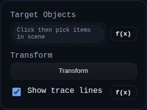

# Explode Body

Status: Implemented

Explode Body applies view-specific transforms to selected solids/components in PMI mode without editing base feature geometry.

## Inputs
- `id` – optional annotation identifier.
- `targets` – one or more `SOLID` or `COMPONENT` references.
- `transform` – translation, rotation, and scale delta for this explode step.
- `showTraceLine` – toggles dashed trace lines from original to displaced position.

## Behaviour
- Captures original transforms per target and can restore them when the PMI explode view is reset.
- Applies transforms sequentially with persistent snapshot bookkeeping to avoid cumulative drift.
- Draws optional trace lines in overlay space for visual exploded-view guidance.
