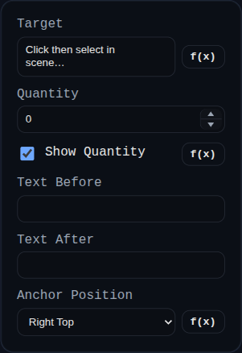

# Hole Callout

Status: Implemented

Hole Callout creates leader-style annotations from hole metadata produced by the Hole feature.

## Inputs
- `id` – optional annotation identifier.
- `target` – hole-related `VERTEX`, `EDGE`, or `FACE` reference.
- `quantity` – explicit quantity override (`0` uses automatic quantity inference).
- `showQuantity` – toggles quantity prefix in the label.
- `beforeText` / `afterText` – optional free text before/after generated callout text.
- `anchorPosition` – preferred label anchor (`Left/Right` x `Top/Middle/Bottom`).

## Behaviour
- Resolves hole descriptor metadata from target geometry and feature history.
- Formats callout strings for simple, countersink, counterbore, and threaded holes (including depth/through-all context).
- Draws PMI-styled leader geometry and persists dragged label position.
