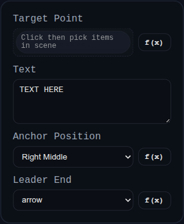

# Leader

Status: Implemented

Leader annotations attach text to one or more vertex targets.

## Inputs
- `id` – optional annotation identifier.
- `target` – one or more `VERTEX` references.
- `text` – callout text (supports multiline content).
- `anchorPosition` – preferred label anchor (`Left/Right` x `Top/Middle/Bottom`).
- `endStyle` – `arrow` or `dot`.

## Behaviour
- Resolves target points and draws leader segments with shoulder layout that fans multiple targets for readability.
- Uses screen-scaled arrow/dot sizing from PMI style settings.
- Persists label world position after drag operations.
