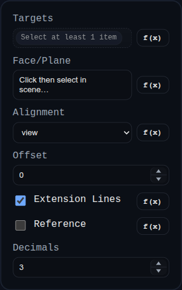

# Linear Dimension

Status: Implemented

Linear dimensions measure distance between two resolved references in PMI mode.

## Inputs
- `id` – optional annotation identifier.
- `targets` – one or two references (`VERTEX`/`EDGE`), resolved as vertex-vertex, vertex-edge, edge-edge, or single-edge endpoint span.
- `planeRefName` – optional projection plane/face reference.
- `alignment` – `view`, `XY`, `YZ`, or `ZX`.
- `offset` – offset distance for the dimension line.
- `showExt` – toggles extension lines.
- `isReference` – formats value as reference dimension.
- `decimals` – display precision (defaults from PMI mode when available).

## Behaviour
- Recomputes measured distance from live geometry each render.
- Draws extension/arrow geometry in overlay space and scales visual size with screen distance.
- Supports label dragging; drag updates stored label world position and offset for stable layouts across reloads.
