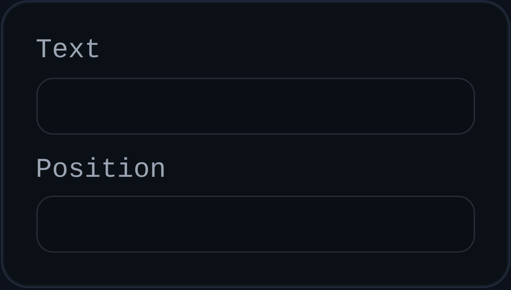

# Note

Status: Implemented

Note annotations place standalone text markers at explicit world positions.

## Inputs
- `id` – optional annotation identifier.
- `text` – note content.
- `position` – note marker position in world coordinates.

## Behaviour
- Renders a dot marker at `position` and a floating label for `text`.
- Auto-places label with view-relative offset when no custom label position exists.
- Supports dragging the label and persisting the dragged world-space location.
