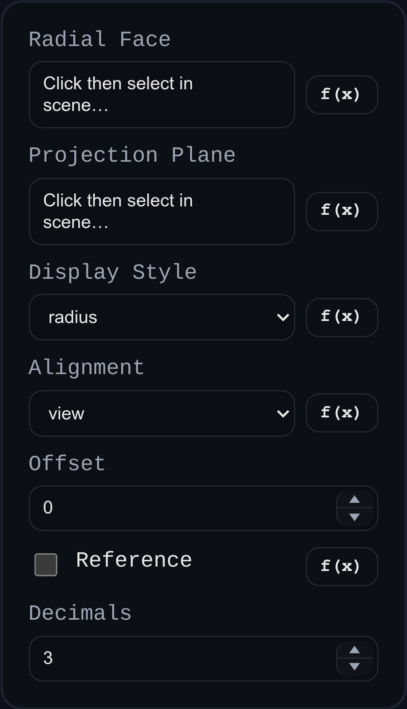

# Radial Dimension

Status: Implemented

Radial dimensions annotate cylindrical or conical-with-equal-radii faces as radius or diameter callouts.

## Inputs
- `id` – optional annotation identifier.
- `cylindricalFaceRef` – target cylindrical face reference.
- `planeRef` – optional projection plane/face.
- `displayStyle` – `radius` or `diameter`.
- `alignment` – `view`, `XY`, `YZ`, or `ZX`.
- `offset` – callout offset from measured radius.
- `isReference` – marks dimension as reference.
- `decimals` – display precision.

## Behaviour
- Resolves center/axis/radius from face metadata and renders the proper radial or diametral leader geometry.
- Preserves associative behavior as source geometry changes.
- Supports interactive label dragging with persistent world-space label position.
