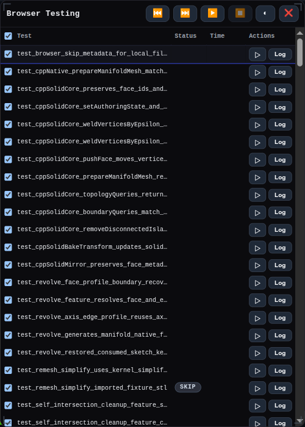
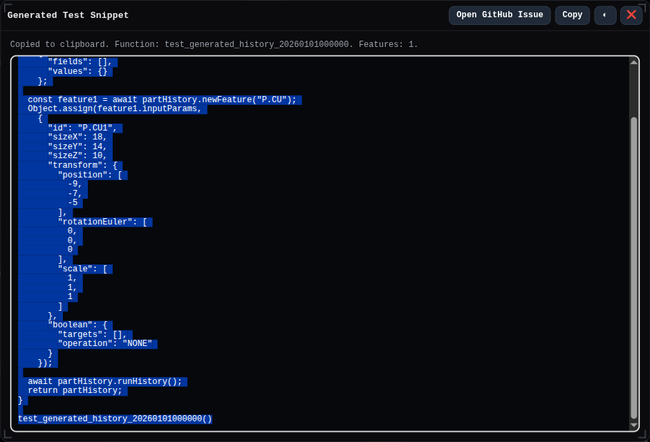

# Testing

The Node test runner lives in `src/tests/tests.ts`.



Run the full suite:

```bash
pnpm test
```

Run one test by passing its exact registered test function name after `--`:

```bash
pnpm test -- test_primitiveCube
```

The runner also accepts an explicit flag:

```bash
pnpm test -- --test test_primitiveCube
pnpm test -- -t test_primitiveCube
```

Test names are the exported test function names registered in `testFunctions`, plus generated names for dynamic part-file import tests such as `import_part_fillet_test`.

Tests that require local fixture files should set `requiresLocalFiles: true` on their `testFunctions` entry, or use a string value when the skip reason needs to be specific. The Node runner will still execute them, but the browser runner reports them as skipped instead of failed. Use `skipInBrowser: "reason"` for browser-only skips that are not tied to local files. As a fallback, browser runs also convert missing local fixture reads under `src/tests/partFiles`, `src/tests/fixtures`, or `src/tests/importTestingData` into skipped results. Do not use either flag only because a test builds solids, exports solids, or exercises features such as extrude and revolve; those tests should keep running in the browser when their inputs are self-contained.

Each run clears `tests/results/` first. A full run writes artifacts for every test that enables them; a single-test run writes only that test's artifacts.

Each Node test run also writes `tests/test-run.log`. This log is intentionally stored in the repository so Git history preserves the run summary. It includes the selected filter, total elapsed time, and one row per executed test with test runtime, artifact export runtime, total runtime, status, and any failure note.

## Browser Repro Snippets

The generated test snippet window captures the current feature history as a browser-ready repro function for bug reports and regression tests.


