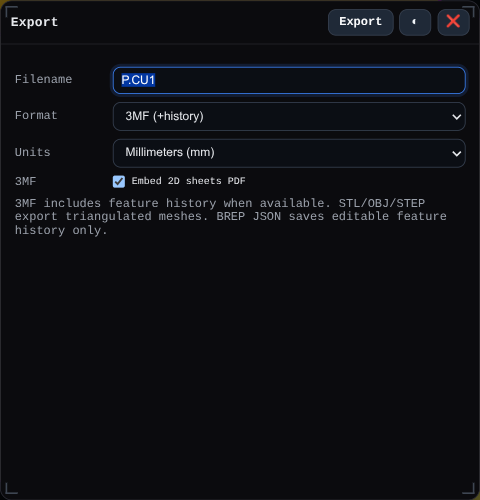

# Export

Opens the Export window for writing the current model to a file format such as 3MF, STL, OBJ, STEP, or BREP JSON.

## Workbench Availability

Available in Modeling, Import, Surfacing, Sheet Metal, Assemblies, Wire Harness, PMI, Simulation, and All.

## Related
- [File Formats](../file-formats.md)
