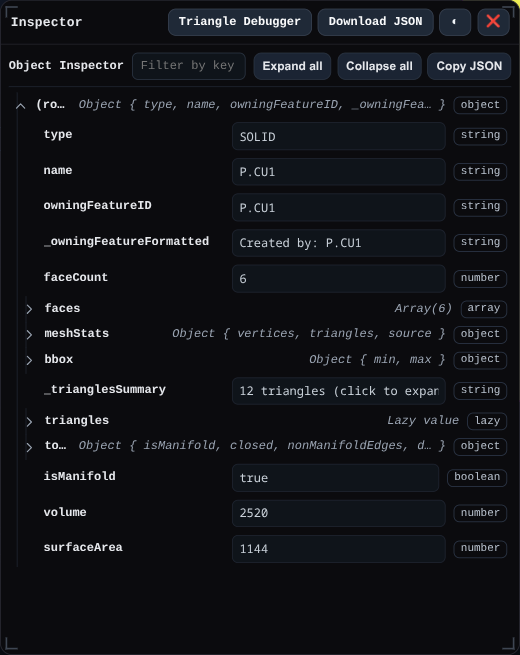
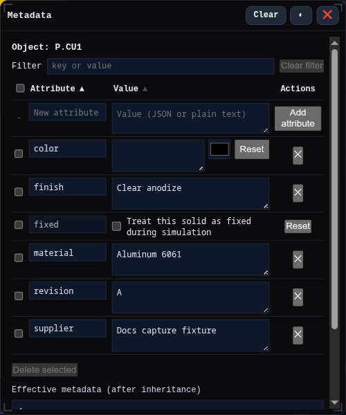
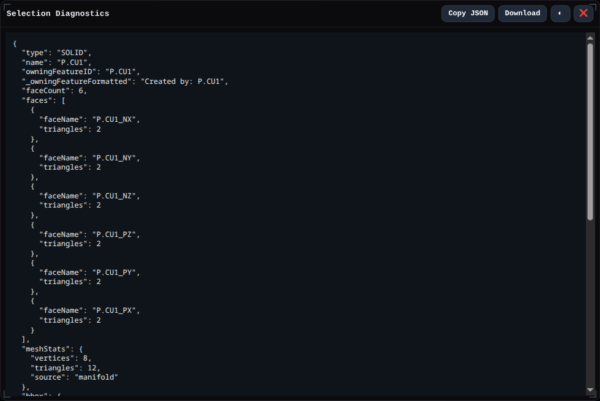
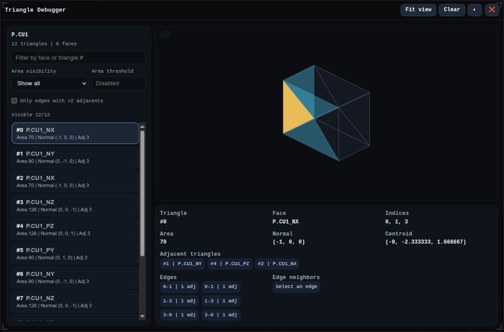

# Inspector

The Inspector is a diagnostic window for answering *“What exactly did I just click?”*. It is meant for troubleshooting mesh issues, confirming the owning feature of a face, or exporting precise coordinates for support requests.

- The `🧪` button on the main toolbar toggles the panel. The window floats near the lower-left corner, can be dragged or resized, and stays on top of the viewport so you can keep modeling.
- When the panel opens it shows a placeholder message. Click any entity in the scene (face, edge, or solid) and the Inspector immediately refreshes with the latest selection.
- The header contains `Download JSON` for a full dump of the current payload (including data that is truncated in the UI) and `Hide` to close the window without clearing the cached selection.

## Reading the panel

Each selection is rendered with the `Object Inspector` tree component, so you can:

- Expand or collapse sections, or use the search box to filter by key/path.
- Copy the visible JSON or download a complete copy for offline debugging.
- Watch for formatted helpers such as `Created by: FeatureID`, `123 units²`, or `123 units` at the top level for quick glances.
- Inspect face surface area, edge length, and owning feature without expanding heavy mesh data.

> Many expensive sections (triangles, points, vertex lists) are lazily computed and only fetched when you expand them. When a preview lists “Truncated”, click `Download JSON` to export everything.

## Data per selection type

### Faces

- **Triangles** – summarized counts with normals and areas. Expanding streams a capped list for UI safety; the download contains the entire face mesh.
- **Edges** – the loops bordering the face, including whether an edge is a closed loop, its approximate length, and the names of neighboring faces.
- **Unique vertices** – lazily generated set of world-space coordinates extracted from the triangle list.
- **Metrics** – formatted surface area, average normal, bounding-box preview, and the owning feature id when available.
- **Neighbors and boundary loops** – lists of adjacent faces plus optional hole/outer-loop polygons supplied by face metadata.

### Edges

- **Length + closure** – precise length read via the edge object plus a `closedLoop` flag when the edge wraps on itself.
- **Adjacent faces** – the names (or ids) of touching faces, useful when debugging history or PMI layers.
- **Sample points** – world-space polylines used to draw the edge, fetched only when the section expands.

### Solids

- **Face roster** – first 10 faces with their triangle counts plus a total count so you can spot unexpectedly dense solids.
- **Mesh stats** – vertex count, triangle count, and the source of the data (either Manifold’s mesh or the authoring arrays). Bounding boxes are computed from the raw vertex positions.
- **Triangle preview** – capped list of triangle data (indices, positions, normals, owning face id/name) with lazy evaluation; the download button produces the full, uncapped dataset.
- **Topology diagnostics** – manifold/boundary checks that report degenerate triangles, edges used by fewer or more than two faces, and isolated vertices so you can locate bad imports.
- **Volume & surface area** – when the underlying `SOLID` exposes `volume()` or `surfaceArea()` the panel surfaces the numeric values for quick measurements.

## Usage tips

- Keep the Inspector open while modeling; every click refreshes instantly, so you can inspect multiple faces without re-opening the window.
- Use the panel in tandem with the Selection Filter to temporarily expose PMI references, sketches, or assembly items and confirm their metadata.
- When reporting an issue, include the JSON downloaded from the Inspector so maintainers receive the same diagnostic snapshot you saw in the UI.

## Related Windows

