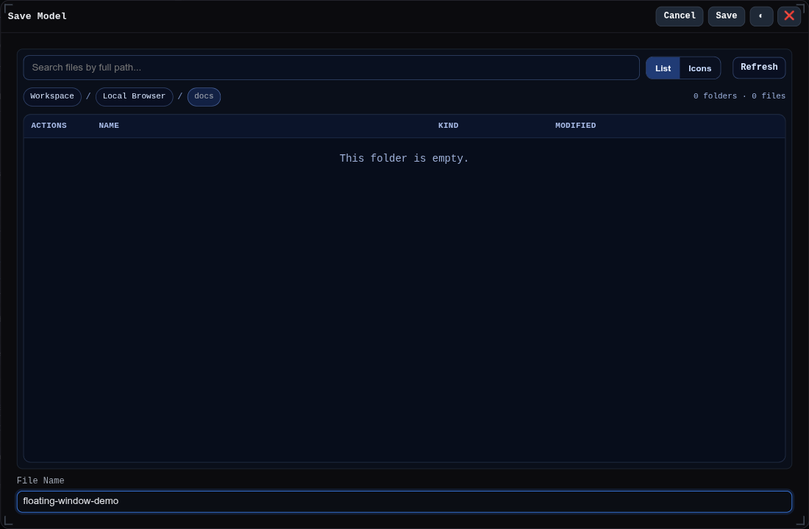

# `💾+` Save As

Opens the Save Model window so the current model can be saved under a different name or location.

## Workbench Availability

Available in Modeling, Import, Surfacing, Sheet Metal, Assemblies, Wire Harness, PMI, Simulation, and All.
