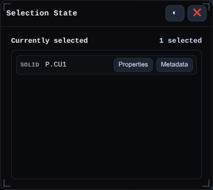

# Selection State

Opens the Selection State window for inspecting the active selection and jumping to related metadata or properties.

## Workbench Availability

Localhost-only. Available in Modeling, Import, Surfacing, Sheet Metal, Assemblies, Wire Harness, PMI, Simulation, and All when development tools are enabled.
